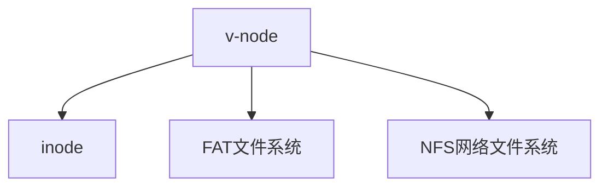

> 之前很早我就用onedrive作为我的网盘，其实我也很好奇网盘里面的文件，是怎么挂到电脑的本地的？网络文件系统和本地有什么差别？这次学了网络文件系统，不得不说大有收获！本章的内容实际上基于RPC，需要对RPC有一定的了解

## 第六章 分布式文件系统

> 上节课我们开始和大家介绍分布式的文件系统，我们说的是当一个系统要扩展的时候，每个组件都要扩展，但是文件系统是其中非常重要的一个部分。上一次我们讲的这个 RPC 的一个思路是说我不能够在本地进程或者本地的代码不需要修改的这个情况之下去实现这个远端的方法调用，我们讲了一个stub，可以是根据我的函数的这个声明就可以生成一堆代码。

我们今天就来想，有了 RPC 之后，我们怎么去实现这个分布式的这个网络文件系统。此外我们也希望大家能够通过这个实现，能够了解到这个除了用来用 RPC 做这个网络文件系统之外，还可以干什么。

### 一、网络文件系统

#### 1）为什么

首先我们来回答一个问题，就是为什么我们要把文件系统放在远端？很早以前，计算资源比较匮乏，集中的这个资源都集中到一些高端的机器上，而剩下的一些机器其实不是特别的好。这个现象在我国的这个 2000 年左右也发生过，包括像北大，包括像很多高校都开始造自己的CPU，造了之后发现跑不动，于是就产生了一个这个回到 1984 的这样一个风潮。

在当时其实除了这个文件系统之外的话，还有ftp、telnet。但这些都不是透明的，就比如说如果你要用 ftp 的话，但我们希望透明的应用程序不要做任何修改，这样的话用 NFS 网络文件系统就可以向往本地的文件一样去访问这个远端的文件。

#### 2）模型

分布式的文件系统有一些不同的类型。  upload download 这个模式的话就是类似于FTP，方法是简单，问题是非常浪费。

- 浪费资源带宽：我们举个例子，假如我要看一个视频的话，我其实同时需要访问很少的一部分这个文件可以，我可能就只想看看视频的开头，而不是把整个都下载下来。
- 其次就是本地的计算机很可能它的空间不够大，我希望把我访问到的部分下载下来。
- 此外，还有可能出现一致性的问题，毕竟可能两个人都在改同一个文件。

但是有了RPC之后，我可以通过 RPC 对文件提供一个 open、write 这个接口，好处是

- client 要什么就取什么，不要的数据它可以不用取，
- Server 最终能够保持整个文件系统对于所有的 client 看上去都是一致。

缺点就是：如果网络出了问题怎么办？网络丢包，永远不知道到底对方的服务器收到还是没收到

### 二、NFS与RPC

#### 1）设计与API

NFS 的设计目标是在 1980 年代写的文档提出来的，全称Network File System，他的设计理念是：

- 任何机器可以同时是客户端，也可以是服务器
- 支持无盘工作站：如果我的文件系统都在远端的话，为什么我本地还需要硬盘
- 我可以支持异构的这种部署，比如说我的本地跑的是son公司的 os，但是我的远端可能跑的是 Unix 的 os。只要大家都支持网络文件系统的协议，这个和我们的Serveless
- 透明性，当我要访问文件的时候，应用程序就仿佛在访问本地的文件，没有任何修改
- 第四个就是从错误中恢复，后面我们可以好好说。
- 最后一点就performance，就我们要用cash、pre fetch。

要用到的RPC方法有：

在这个里面有哪个API是文件系统没有的API？思考一下？open和close。为什么没有这个API我们后面再来讲。

#### 2）NFS协议 Mount

mount 它是请求对方暴露一个文件的树。这个暴露的文件树，它是以一个目录作为一个根节点，然后就像我们`mount`一个 u 盘到本地的那时候一样。 mount 到本地来之后，你再访问本地的这个目录的时候，就可以相当于是访问远端的这个目录了。

这里首先要理解`vnode`。我们前面讲过`inode`，`vnode`它下面对应的可能是 i node，有可能是 FAT 文件系统，有可能是 nfs 网络文件系统。FAT 我们当时讲说是个链表连起来的。

我们把一个 u 盘插到我们的笔记本上面，笔记本装的 Linux。我们的笔记本该怎么去访问 u 盘上的这个 FAT 的文件系统呢？Linux认为一切文件都是inode。但是我的U盘上没有inode？这个时候 Linux 的程序员就很聪明， 他们说我们发明了 i node 很好用，我们的整个文件系统都是基于 i node，但是你 FAT 没有 i node，于是我们就为你创造一个 i note。会为每一种文件写创建一个 i node，保存了这个文件大小、属性信息。 FAT 本身没有inode，但是FAT 它也是会记录文件的大小，Linux会先去读这些文线的权限和大小，把它读出来之后存到它创造出来的这个虚拟的 inode 里去，虚拟的 inode 的就叫做 v node。

对于vnode的操作就叫VFS，对于 VFS 来说，如果底层恰好连接的是一个由 i node 的一个文件系统，比如说 ext4，那就很方便了，我读一个 i note，把下面的内容填充到这个vnode里面，就结束了。如果是其他的，但如果下面是一个FAT，他就通过对这个 FAT 下面的某一个文件进行一个读取操作，把元数据提取出来放到这个vnode。

我们看一个例子：

- Server 把自己的一个叫`/etc/exports`暴露出去
- Client mount `192.168.1.100:/users/paul /home/paul`挂载上来

挂载了之后，你访问本地的文件，就等价访问远程的了。目录和文件有一个访问的文件协议：就是我们前面提过的那个表格， 但是没有open。他多了一个操作叫做 look up，look up 是给我一个文件名和目录，我告诉你这个文件相应一些元数据，look up和open 有一个很大的区别。

读取NFS文件的过程是啥样的？

- 首先，下图的Application NFS Client都是客户端的本地的东西，然后NFS Server是远程的东西
- NFS Client是跑在本地的内核态的一个程序，或者理解为一个库，然后Application是用户态
- NFS Client与NFS Server之间走的是网络
- 首先应用程序调用OPEN，NFS Client就会给服务器调用LOOKUP，在这个目录下面找到一个叫 f 的文件。一旦找到了就给它返回一个 file handler 和 file 的attitude。
-  file handler是什么我们待会解释，记住传回来的是一个表征这个文件的一个句柄，以及这个文件相应的这个属性，包含它的大小等等，它的这个 a time
- 然后 application 就得到了一个FD，这个FD是由 NFS 客户端返回的
- 然后Application调用Read读取，利用刚刚的fd，然后传了一个 buffer 和 n 读取的大小
- NFS的 Client 要记一张表格，记录了 FD 到这个file handler的映射。当接收到要读某个文件的时候，就把fh、和要读取的大小n通过RPC，调用NFS Server
- 然后nfs Server 就会去读这个文件。读哪个文件呢？根据你的 by handler 去读这个文件。读完以后得到了一个buffer，然后把这个 buffer 和文件的 attribute 一起重新传给这个 NFS client，NFS client 就会通过把这个数据返回给这个client，然后 application 读到这个数据之后就调close
- 结果这个 close 就直接短路了，没有任何的这个像 NFS Server 的这个 RPC 就返回。

为什么要这样设计？我们来考虑一下这个系统里面要维护的状态在哪？服务端没有维护状态，可以说是类似restful的，返回的所有的状态就都在NFS的Client里面保存着。假设我们在上图里面的红色部分`No State after Open`那个地方发生了一次重启，速度非常快，那么对于客户端，是无感知的！因为服务端没有保存任何信息，所以容错能力大大加强。

再来思考File Handler也就是上面说的fh是什么？NFS的 Client 自己要维护一张表格，记录了 FD 到这个file handler的映射。当接收到要读某个文件的时候，就把fh、和要读取的大小n通过RPC，调用NFS Server。FH到底是什么？给你三个选项

- 文件名
- 文件名+绝对路径
- inode number

我们来分别考虑：

- 文件名肯定不行，因为会重名
- 文件名+绝对路径：也不行，我 open 的时候它叫s文件，然后在你 read 之前把这个 s文件 改成了d文件，这样下来第二次就打不开了，这个叫做 time of open to time of read 有一个时间窗口被人改了这个问题
- inode：假如有人把这个inode100的文件删除了，然后又新建了一个文件，这个文件正好是inode100，这样你就会打开别人的文件

大家现在就已经有这个我们所谓的 CSE 的思维：

- 断电思维
- 一铲子把网络挖断怎么办

最后的实践是什么样子啊？最后使用的inode加版本号。因为文件系统，如果你用文件名加一个版本号，其实跟 i node加版本号是差不多的，相对来说可以让传输的数据更少一点。此外，File handler 还必须要包含一个文件系统的ID！这是为啥呢？

我们在谈论一个 name space 的时候，我们一定要考虑它的上下文是什么，就当我们在讨论一个虚拟内存地址的时候，我一定得知道这个虚拟内存的地址它的页表是什么，因为你换了一个页表，同样一个地址指向的可能是不一样的东西。所以当我们在讨论 i node number 的时候，我们得知道这个文件系统是什么。比如在我的 Server 上有好几个文件系统，每个系统都有自己的101号文件，所以你光给我一个 100 号 i node 的其实是不够的。

第二个问题：我在读取的时候，传递进去的是`READ(fd, buf, n)`，然后读取的时候`READ(fh, 0, n)`，为什么不是传一个 n 就可以了？还要多传递一个0？因为0代表的就是curcor，就是说文件指针的位置，回顾我们ics里面学过的那个文件指针。由于 Server 端是无状态的对不对？服务端不会保存指针，当我这边读fh 0 到 n 的时候，根本就不需要把那个文件打开，它可以在收到这个 RPC 请求之后再 open 这个文件，再从把这个指针移到该移动到的位置，再去读要相应读的这个数据。

既然我在 Server 这端没有任何的状态，所以当我们调用 close 的时候，它这么操作相信你们也就能理解了，不需要和服务端通信。所以这是为什么整个 RPC 的这个协议它不需要open，也不需要 close 的原因！这张图信息量非常大。

#### 3）案例一：Rename After Open

目录一，被人 rename 成目录2，目录 3 被人 rename 成目录一了。这里有一个非常重要的一个点，就是网络文件系统的行为，应该跟我们的本地文件系统的行为是一致的。

- 如果是本地文件系统，我们应该读取到dir2下面的
- 所以在 NFS 里面的话，我们也需要同样的这个语义

此外NFS服务器，具有Stateless，好处如下

- Server 可以容忍很多这个crash
- 由于 Server 端不需要保存类似文件读写指针的东西，所以它对资源的消耗也比较少。
- 对于 client 来说，一旦它的这个 read 失败了，比如说我们前面提我要 read n，失败了没有得到任何响应，超时之后，他又发起了一次新的Read，这个新的Read变成对于 Server 来说其实还是从0读到n，而不会说你读两次就变成从 n 读到2N。因为你在重复的 RPC 的时候，每次传过去的参数都是 0 到n。

#### 4）案例二：Delete After Open

就是在 Windows 上面的话，当你打开一个文件之后，你是不能把它删掉，它会告诉你文件正在被使用，无法删除。但是Linux里面可以。当你在这打开一个文件A，删掉一个文件A，又创建一个同名的文件A之后，这边再去读这个FD，对于这个 local FS文件系统来说呢，它读到的**应该是那个旧的文件**。大家还记得吗？我们讲过一个 DELETE after open 的case（出CSE考卷的例子），对于file table来说，如果有个文件已经打开，但是同时把他删掉，这个文件其实不会被马上删除，他要等到打开这个人 close 的时候再把它给删掉。

但是在网络文件系统里面的话，由于没有状态，所以 Server 并不知道有人打开这一个文件，所以他读到的**可能是那个新的文件**。为了避免错误，所以我们就加上一个 generation number。加上版本号之后，当 client2 再去读取那个文件的时候，它是没有能力读到那个旧的文件，因为旧的那个文件已经被删掉了，因为 Server 其实并不知道有人打开这个东西。所以他只能报错，说打不开了。

总结：网络文件系统并不能达到和本地的时候，一样的语义。这就是一个 trade off！我们已经尽力了。

#### 5）NFS的性能区别

NFS 和本地的相比还有一些区别。

- 第一个就是它比本地的要慢很多，网络文件系统的性能取决于服务器的这个性能和这个网络的这个时间
- 一个可能的优化在于这个cache，目标就是为了减少在网络上的这个传输。
  - 比如说刚读完一个数据，然后我要再读这个数据的时候，我可能就从本地直接读了。
  - 另一个就是这个 read link，是吧？就是和这个和 read 其实差不多，这个里面有些小区别，这里就不再提了
  - 还有一个get attr 就是得到这个 i node 的一些信息，这点的话，其实我们说其实也就是可以缓存在这个用户的本地。
  - 此外还有LOOKUP，其实是比较 tricky 的。Lookup本质上是要得到一个 i node number，如果说我们缓存在本地的话，有可能这个缓存和服务器端的这个真实的这个文件可能是会发生变化。但是我们可以说在一定的时间之内，我们如果通过一些锁的方式来说，这个时间段内你不要去那边有什么文件的增删改除这个操作，那么我这个 lookup 就可以缓存了。
  - 此外readdir也是类似的，

在Server端，cache 是自动实现，所谓的自动实现也就是它本地本来就有自己的这个 buffer cache。就是在读文件的时候不一定每次都要从磁盘上去，而是从他自己的缓存里面去读。此外，所有的 NFS 的写都是写穿到磁盘的，否则你重启之后就会导致数据的丢失。

#### 6）Cache coherence

一旦有了 cash 之后，就会导致 cash 的这个**coherence**的问题。当多个 client 打开NFS的同一个文件，如果你有你的cache，我有我的cache，就会导致大家 cache 不一致，cache 不一致有几种解决思路。

- 第一种思路是一种比较难的思路，叫做 read write coherence，任何一个 client 去读到的数据，永远是最近的一次写的这个数据，但是而且这有个问题，就是它比较难实现
- 还有一种那叫 close to open 就是我打开一个文件，然后我 close 一个文件。在中间，如果有人读的话我就不能保证了。但如果我 close 完了以后又有一个新的人 open 了，那这个可以保证新的打开的人能够读到最新的这个数据。

左边的Case1里面，Read在上一次Close里面，一定可以读取到最新的文件。右边的Case2里面，client2的open在左边write后面，左边close的前面，这时候就不能保证了

- 如果是按照上面的第一种思路，叫做 read write coherence，那就可以实现，读到最新写的，但是这样效率太低了
- 如果按照上面的第二种，那就肯定读不到最新的了。在close的时候，我们不能够就这么简单的close，还需要保证与远程的文件同步所有的写操作

#### 7）VFS

> 有了这个 NFS 之后，我们需要把它整合进来，于是我们就提到了这个VFS，VFS 所有的这个 inode 都是保存在 client 这一端的。这个 VFS 所有的这个 inode 都是保存在 client 这一端的。

NFS one 会维持一个 v node，这个 v node的里面有很多文件的元数据，这个文件的元数据本质上就是文件的从远端读过来的attribute。然后它会记在本地，然后作为一个cache，同时也可以基于这个VFS，去做一些这个跟 inode 的相关的一些操作，比如包括cursor记在哪里，在这个本地的话其实都是用 VFS 来保持的，然后 VFS 它对象的接口都是和普通的 inode一样的，Read Write一样的。

#### 8）Validation

那什么叫validation？就是我们如何才能够去检测出那些不一致的这个点？对于Server、Client，他们都会去记录文件的这个时间戳，然后当文件去打开的时候，我们就会比较一下这个时间戳是不是一样。如果说我本地 cache 的数据和远端的数据一比，发现还是远端新，那我就把本地的数据**invalidate**掉，让他失效。当过了一段时间之后，比如说过了 30s，那么它就默认就把本地的 cache 把它给清掉，或者说把它给 invalid 掉，这样的话就避免出现这个不一致的情况。

当然你说为什么是这个 30 秒呢？工程上 30 秒钟，目前看是一个比较相对来说比较合与人处的情况。但是但肯定不能够对所有的场景都适用，要具体情况具体分析。此外，如果一个 data block 被改了之后，就要把它标记为dirty，然后在 close 的时候把它给 flush 掉，这样的话在我们前面的那张图里面 close 什么都不干，要做一个小区别。

#### 9）VFS的示意图

其实这个图设计的是非常漂亮的，整个Linux的文件系统精彩就精彩在这里。

- 看client这边，它有一个 user application，调一个open，比如要打开一个文件。它并不 care 你到的是本地还是远端，然后这个 open 就到了这个 file system Call layer。这个 call layer 对接的只有一层，就是vnode层次。
- vnode layer它不 care 底下到底是本地还是远端，它所有的操作都是在 vnode 上做的，然后通过传进来的这个参数，vnode layer判断出来这是一个远端的NFS。于是他就找到了对应的 NFS client，把这个 open 操作所对应的 look up 操作转变成了远端的一个 RPC 的一个 look up。
- 然后 RPC 的 lookup 就通过 RPC 的stub，通过网络传到了这个 Server 的 computer 的一个 Server 的这个stub，然后继续往上走到 NFS 的这个Server
- 到 NFS 的Server，它就继续往上走这个look up，又到了这个vnode层次
- 【注意】：右边的NFS Server 调用V node layer，和左边的File system Call layer调用V node layer，这两个lookup的本质是一样的。下图里面的红色圈圈
- 然后，右边的vnode layer，就会调用到本地文件系统。当然，这里的本地文件系统，可以是ext4，也可以是本地文件系统

所以换句话说，我们再想一个极端一点的例子，如果我这个 NFS client 和Server是同一个机器，是不是也可以？所以在 vnode这一层，通过RPC之后其实一切都打通了，所以我们就是说这个层次的这个设计就是有这个好处，vnode这一个层次，我不care你来自于本地的一个 LOOKUP 的函数，还是来自于远端的一个 LOOKUP 函数。

甚至来说，上图里面右边的Server Computer，Vnode layer可以Lookup另外一个远端的文件系统，这样套娃。也就是说A可以lookup到B机器，然后B再进一步lookup到C机器！VFS 这一层把这一切都打通了，所以这个设计就变得非常的灵活。

当时我记得问你们的这个董明凯老师，我说你觉得linux的设计哪里非常漂亮，你看这个 VFS 设计的就非常漂亮。还屏蔽了底层不同的文件系统的差异。

#### 10）提高读取性能

我们怎么才能进一步的去提高读的速度呢？

- 要增加传输的这个最小单位的这个大小，早期的磁盘是 512 个字节，后来的磁盘我们今天的磁盘就是 4K 最小读写单位，但是在网络文件系统里面他要大一些，因为我好不容易给你建立起一个连接了，每次就传4K，太少了，亏了，所以一般是8K
- 然后这个 read a head 就是相当于是提前去做一些这个读取这个操作，不是说真的要读，而是有一个预读的这个操作，这些都是我们说的一些优化。

NFS本身自己也在做迭代，在 version 3、 version 4 增加了不同新的功能，直到今天我们 NFS 还在不断持续演进。

### 三、分布式文件系统

#### 1）NFS的问题

- 第一个问题就是它的Capacity，NFS 它还是说跨一台机器，它不是说跨多层机器。只不过是这台机器本身它可能槽比较多，可以插很多槽，但是它依然只能够连到这一台机器。除非这台机器再连到下一台机器，那这个就有一个级联了，网络开销会进一步增大。

- 第二个问题是，一旦这个 Server crash，除非他们很快重启，否则其他文件也会有问题。我们希望的是能够要防御住任何一台 Server 的这个crash，不能够说有一台 Server crash，然后就都没有。
- 第三就是performance，每次我们去读文件的时候，还是最后落到Server 去读这个单点这个文件，以及用一个网卡的这个性能，而不是说我可以同时从三台 Server 去读这个。

数据中心有很多台服务器，有没有可能我们把多台服务器把它整合在一起，变成一个分布式的文件系统，而不是说有一台很强的服务器为所有的人提供这个单点的一个服务。我们同时还要去保障这个透明性。

#### 2）L1：block层

第一个方式的话就是这个 block layer，做一个这个分布式。怎么分成多个呢？我们需要把 block ID，把它给 extent 一下，变成网卡的一个 ID 和一个 block 的一个ID。不一定是真的是这个 Mac 地址，也可以是别的这个地址。

第二我怎么能够让一个 client 知道哪台机器上有一些空闲的这个块呢？以前我们在单机上我们有一个 free block 的一个 bit map，但现在是多台机器了，怎么办？

- 第一种方法，我们随机选一台，如果他有 free 的我们就拿过来，如果没有，再随机找下一台，直到找到为止，这是第一种啊。
- 第二个方案就是使用一台 master Server  去记录下这个每台机上面的这个 free block，然后我们只要问这一台 master Server 就可以
- 思考：你说你这个弄一台 master Server，那这个 master Server 会不会变成一个瓶颈呢？你不是要分布式吗？你分布式怎么弄一个master？那不就集中了吗？这就是我们在讲分布式系统里面一直要用到的一个原则，那就是我们把 data 和 Meta data 把它给分开， Meta data 尽可能的集中， data 尽可能的分散。Meta Data要放在性能很强的机器上面，有了这个之后查询的过程走这台 master 节点，而真正访问数据的过程则走那剩下的比较弱的这个机器。

#### 3）L2：是否重新设计File Layer

File Layer是第二层，我们前面学过一个inode里面可能对应多个block，比如说本来是一个文件的第三个 block 的block number是78，那么由于我们这个现在还不需要去访问这个文件，我们可以到用的时候再去访问这个文件。所以暂时我们可以不用重新设计File Layer。

#### 4）L3：inode Number 层

那么在这个 i node 的 number 这个这一层，我们就需要去做这个distribution，也就是我们现在有好多个机器，每个机器都有自己的 inode 机制。那么我们怎么才能够去实现一个分布式的一个 m 的机制呢？

我们想一个办法很简单，就是在 master 节点上把 i node 的 table 去做一个这个保存。换句话说，这个 look up 的过程，我们把它定向到这个 master 节点，这里有inode table，然后把这个 block layer 全部都放在一台一台的这个 Server 上，这样的话不就相当于是我们把 Meta data 和 data 做了一个这个区分吗？所以file system Meta 包含了 free block、包含了 i node table，就是一台机器一台节点，剩下的就是分布式的这个多台这个节点。

#### 5）L4：File Name Layer

这一层和以前几乎就是没有什么太大的这个区别，为什么？因为当前的这个文件其实包含在什么地方也是通过这个 master 节点来去实现，所以我们这个只要通过 master 节点去找到这个对应的这个 i node，具体的进inode找就好了。所以这层不需要做太大的这个变化。

后面的L5其实也不需要改变了，这里就不赘述了。这样实现的一个分布式文件系统，我们其实只要在 open 的时候得到对应的这个 i node，后面的话在读写的时候就不需要去和 master 节点去打交道了。

#### 6）可能的问题

- **性能**：那么到目前为止，我们这个设计它的性能其实相对来说不是特别的好，因为我们现在有大量的这个 round trip time，就是我们需要多次的这个来回的这个做网络的传输。就算我们用cache，但是对于这个文件里面的数据的话，你再怎么样也会就第一次读的时候还是需要这个有 round trip time，尤其是有些文件可能非常的大。那么我们可能需要和多台机器同时去做这个communication。
- 这里还有一个潜在的优化空间，我一个这个数据，我可能保存在 10 台 Server 上，我可以同时跟着 10 个 Server 说，你们每人给我读 100 兆。这样正好就可以加速了。
- **可靠性**：接下来一个问题，就是关于这个reliability，就是说如果我这个 master 挂了怎么办；此外如果我这个文件放在 1, 000 台 Server 上，这 Server 里面有一台挂了，我这个文件就没了，
- **正确性：**一旦发生了一个Failure，整个的文件系统的状态都会出现冲突。比如说我这个写数据，第一个写成功了，第二个写失败了。怎嘛办？再比如Rename的时候，一个Ref cnt要减，另外一个要加，这个更复杂了。

### 四、GFS

> GFS被誉为是这个 Google 的三驾马车， Google 当时启动三辆马车，分别是《Google File System》、《Google MapReduce》以及《Google BigTable》

#### 1）设计目标

对于Google这种搜索引擎公司，具有一些比较显著的特征

- 很多文件，第一是大文件，第二这些文件他不会改，只会追加。例如当一个文件或者网页发生了更新的时候，它并不是把那个更新的文件替换原来的文件，而是把更新的文件附在原来文件的后面，记录不同的版本
- 另外一点就是大量的这个组件都会出错，因为它有上千个小机器，应该说了出错的概率非常的高。每六个月的这个出错重启的这个数量啊达到60%，到第 11 月的时候 100% 的机器都会发生重启
- 一旦创建之后文件大部分都是读，而且经常是这个顺序读，而没有这个随机读的这个情况
- 于是 GFS 他就做了一些调整，他不提供 posix API，就纯粹的这个实用主义，自己用就够了。比如rename没有，因为 rename 要做到容错很难

#### 2）架构图

GMS 的这个 architecture 就变成这样，中间有一台 master 节点，跟我们前面说的一样，然后这个 master 节点有 n 个 chunk Server，这个 chunk Server 就是我们前面说的用来保存数据的这个Server，然后每一个 chunk Server 都会有固定大小的的chunks，chunks的大小是64M。所有的 Meta data 就是这个 master 节点会把一个文件映射到不同的这个chunks。作为它的这个类似于inode的作用。

一个文件是由很多个 64 兆的 chunk 组成的，这个 chunk 不一定是在一台机器上，可能是在多台机器上，然后每个文件就是它的一个非常重要的特点，每个文件的每个 chunk 都有 3 备份，如下图所示。

#### 3）chunk

对于一个文件`/home/alice/a.txt`，我们传统的是查找`/`然后`/home`，然后等等的一套下来，Google直接把整个作为一个字符串，然后哈希一下，提高效率。唯独的缺点就是，不支持文件夹和文件的改名字了。简单粗暴但很有效。

chunk handle 的就是 chunk 的ID，它是由一个 64 bit 的一个 number 来组成的。chunk 保存在磁盘上，就像一个普通的 Linux 文件一样。对于这个非常流行的文件，甚至有更多的这个备份。

大chunk的好处？为什么我们要把这个 chunk 变 64 MB？

- 就是普通的一般是 4 到 1 兆这个 Linux 里面但是我变大了之后，我就可以减少频繁的在 master 和这个client的交互。
- 当我们把这个 chunk 的 size 变得很大之后， chunk 的 number 就变少， chunk number 变少之后， master 就可以把所有的 Meta data 都放在内存里，而不用放在磁盘上，因为可以减少这个 Meta data 的这个数量
- GFS 的这个master，它其实维护了所有的文件的这个元数据的这个信息。然后这个 master 会把他所有的这个数据做一个备份这个备份平时是不用的，当他改了以后，他会同步给这个备份。然后一旦这个 master 挂了备份立刻就能够顶上。

#### 4）和简单的分布式文件系统区别

就我们前面提到过这个非常简单的分布式文件系统，它相当于是去保存这个 i node 的这个 block 的这个number，而不是像GFS直接就保存这个 chunk 的这个位置？

- 第一：GFS这样的性能更快。
- 第二：简单的分布式文件系统没有Replica的备份，而我们这个有。

#### 5）为什么一个Master

 GMF 使用一个master，为什么？因为一旦 master 有两个，这个系统会变得非常非常的复杂。在 CS 里面有一个黄金原则叫做 single writer，就是你的 writer 只要有只能有一个，一旦你有两个 writer 或者更多，大家都会冲突。你说挂了怎嘛办？这台机器只用考虑 Meta data，这个性能要求其实不是特别的高。此外就是他要做的这个工作其实也不是特别多，他只要去记录下 name to chunk 的这个 Mapping 就可以了，这个mapping甚至可以放在内存里面。

此外它还有一个 operation 的这个log， 保存在磁盘上。他没有把这个 chunk 的 location 永远的这个保存下来，在启动的时候就所有的 chunk Server 其实是有可能发生变化，因为一旦某一个 chunk Server 挂了，有可能会重新起一个去替代它，这样的话在 master 这边就可以及时的去做这个更新检测。

GMS 的 client 它的代码是直接被映射到每一个 application 中间，你说，唉，等等，我们的 application 不应该是通过 open read write 这样的方式去访问文件系统吗？ Google 说，不用，我给你个library，你用我的library，我 library 里面都写好了。它其实整个把 os 的这个 open read 这套把它给劫持了，直接就通过网络去联系这个 master Server。此外它还没有任何的开始，为了保证保持数据的这个一致性。

#### 6）读写文件

在GFS中读取文件很简单：

- 联系Master
- 获取文件的元数据：chunk句柄
- 获取每个区块句柄的位置，每个区块有多个replicated的区块服务器
- 通过任何可用的chunk服务器以获取chunk，如果发现哪个服务器不可用，自己去找另外一个可以用的去下载

在GFS中写文件怎么办呢？

- 写的过程我们知道要保持叫 single write，我们不能够允许多个人写一个，因为这样会冲突（比如A往第一个备份里面写，B往第二个备份里面写，这样就会不一致，我们只允许往一个Replica里面写）。所以 master 会 grant lease（租约，有时间限制的令牌），它是一个有时间期限的可以写的令牌，master就会给replica中的一个lease，当前你就是这个chunk对应的primary，只有这个primary才能改这个chunk，还有两个replica怎么办?就由这个primary告诉它们怎么写，如果超时了primary还可以续租。
- 那么写的过程分成两个阶段
- 第一个阶段就是把数据发过去，但是不写到这个文件，没有落硬盘
  - 一个 client 它会被提供一组Replica，就他写的时候最终是要写到三个备份的，如果是一个一个的写，那速度肯定慢了，它可以发给一个最近的server，让这个server把数据发给其他的server，因为server之间的传输是相对比较快的。如果在传数据的时候发送crash，充其量删了就行。
  - chunk server就会把数据放在这个 cache 里面，这样的话 client 就把这个三个chunk server 的数据写好
- 第二个阶段，写完之后我们再去真正去 write data，当我们要把这个 data 放到这个数据这个文件里面去的时候，我们相当于是要做一次这个 commit 这个操作
  - client发一个write request发到primary，先应用到自己的chunk上，然后再告诉其他两个chunk server，当三个都结束了，才会告诉client写完了。
  - 在此期间，client一直需要等待，这样整个写操作才算写完

为什么要分成两个阶段呢？我们想把control flow和data flow拆开，data flow的先后是无所谓的，我们先做慢的，order不重要。到第二阶段的时候，primary发给所有的secondary。我们考虑大量的append，真正关键的是谁在前谁在后，不要互相覆盖掉。所以这时候就有primary去负责去排序order。

我根据自己的理解画了一下两个阶段的示意图，首先第一个阶段是data flow，重点在于把文件的数据给写完。第二个阶段在于同步Replica，备份。

每个Chunk有自己的版本号，用来检测是否某个版本有陈旧的数据，如果有的话，旧的数据就会被踢出去。Primary如果发现哪个secondary版本过时了，就把它踢掉。

#### 7）GFS中命名

在GFS中没有dirctory的概念，GFS的目录就是一个**字符串**，最后映射到metadata上，其实就是一个pathname to metadata，其实就是一个key-value store。这都是在master上去记录的。为什么我们的PC上不用这种方式呢？有什么问题？什么操作会很慢？比如搜索操作、改目录名的操作，需要把全部包含这个目录名的文件找到，然后一个个去改，因为它没有去做层次化，是个扁平的。

#### 8）HDFS

有了GFS之后，就有开源的HDFS（Hadoop Distributed FS）。它允许在大数据集上使用集群的分布式处理。它是一个GFS的开源设计，可以在廉价的服务器上做集群、有高容错和大规模的吞吐和部署能力。

它分为namenode和datanode，其实和GFS的逻辑差不多，换了个名字而已。

总结：分布式的文件系统设计不简单，比如通过单个节点+RPC实现。需要综合的考虑performance, consistency model和failure handling，我们学习了两个案例，NFS和GFS。
- NFS：透明的文件访问、scale做的不好，容错做的不好
- GFS：针对谷歌工作负载优化的高度可扩展和容错DFS、相对的一致性的模型、适合谷歌自己、单一的Master（当然next-generation of GFS解决了这个问题，后面的事情了）