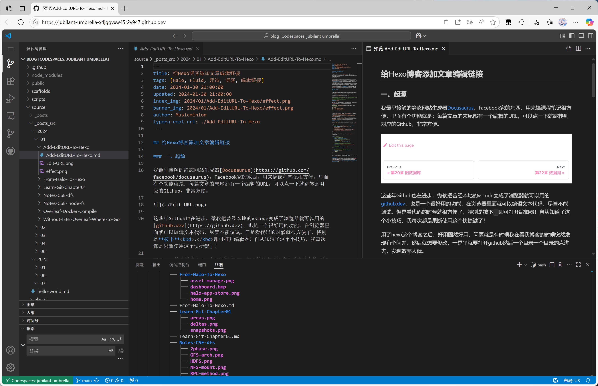
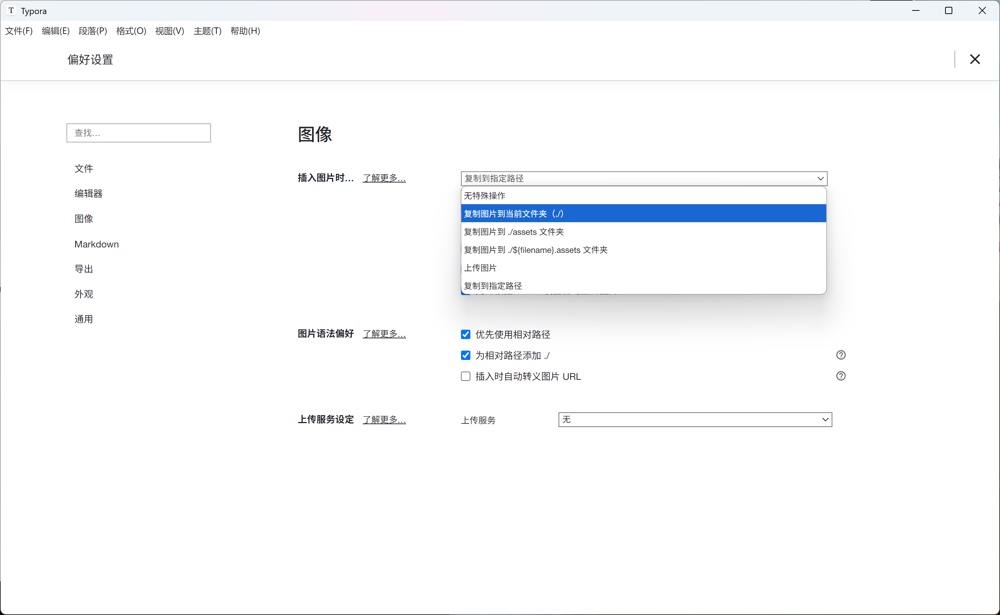

## Hexo 的图片资源的重新优化



今天这篇博客不聊别的，相信大家从这个图就已经看到了，我对 Hexo 的图片管理逻辑做了一个小的优化。这样在 VS Code、Gitlab 预览里面也可以优雅的看到图片的内容了。

### 一、背景

前情提要：Hexo 的图片存储的逻辑实在过于奇怪。对于一个 `abc.md`​ 的文档，要求图片路径必须放在 `./abc`​ 文件夹下面，这个要求其实不算过分，但是过分的是，Markdown 里面的图片的路径必须是 `./image.png`​，而不是 `./abc/image.png`​。

其实我觉得这个问题本质是<u>博客框架的开发者自己偷懒</u>，**把问题甩给用户**。毕竟但凡知道一点 Markdown 语法、知道图片要存在相对路径的，便于搬家的用户都知道，这种逻辑是个多么诡异的操作。

这就导致很多一系列的问题：

- 首先，Github 上面的 Markdown 文档的预览，图片都没法显示，全是加载失败
- 其次，用 [Typora](https://typoraio.cn/) 编辑器写作的用户非常煎熬，每个文档必须手动指定 `typora-root` ​的目录。用其他编辑器写作的体验只会更糟糕。
- 每次发布博客都需要手动修改图片路径的 URL

其实要说这个图片路径的问题，Facebook 的 [docusaurus](https://docusaurus.io/ "docusaurus") 就处理的非常 nice，他可以自动查找文档引用图片的相关的目录，根本不需要用户手动介入，所以我到底该怎么办才能优化。

### 二、我的解决方法

#### 1）文件结构的组织

经过我的一番考虑，我最终选择了这样的目录结构：

```bash
@Musicminion ➜ /workspaces/blog (main) $ tree ./source/
./source/
├── _posts_src (日常编辑使用的)
│   ├── 2024
│   │   ├── 01
│   │   │   ├── Add-EditURL-To-Hexo
│   │   │   │   ├── Edit-URL.png
│   │   │   │   └── effect.png
│   │   │   ├── Add-EditURL-To-Hexo.md
├── _posts (真正用于构建的，添加到git ignore)
... # 以下省略
```

一些逻辑：

- 每篇博客一个专属的文件夹管理
- 因为之前的文章里面，所有的图片引用全部都是 `./image1.png`​，把 markdown 和图片放在同一个文件夹，这样就可以准确的显示每个图片的内容。但是为了保证 Hexo 这样魔幻的操作，需要在构建之前，把 `Add-EditURL-To-Hexo.md` ​移动到当前文件的上层。
- `_posts_src`​：用于日常编辑 markdown，Git 提交文件。`_posts`​ 用于编译构建，但是不作为 Git 管理，相当于编译中间层文件
- `generate_posts.sh`​：用于每次构建前预处理所有的 markdown 文件。

#### 2）脚本

所以我增加了这样的脚本，扫描所有的 markdown 文件，然后如果发现当前的 markdown 和文件夹的名字一样，那就把他移动到上层。

```bash
# /bin/bash

# 本脚本用来把 source/_posts_src 里面的博客文件复制到 source/_posts 目录下，并把所有的markdown文件移动到上一级目录。

# 需要在 source/_posts_src 目录下执行
# 先检查当前目录是否存在 source/_posts_src，如果不存在直接退出报错
if [ ! -d "source/_posts_src" ]; then
  echo "source/_posts_src directory does not exist. Exiting."
  exit 1
fi


# 检查 source/_posts 目录是否存在，如果不存在则创建
if [ ! -d "source/_posts" ]; then
  echo "Creating source/_posts directory."
  mkdir -p source/_posts
fi


# 删除 source/_posts 目录下的所有文件
echo "Deleting all files in source/_posts directory."
rm -rf source/_posts/*


# 复制 source/_posts_src 目录下的所有文件到 source/_posts 目录下
echo "Copying files from source/_posts_src to source/_posts."
cp -r source/_posts_src/* source/_posts/


# 对于递归 source/_posts 目录下的所有 markdown 文件，检查他和所在的父目录是否同名
# 如果同名则将其移动到上一级目录
echo "Moving markdown files to parent directory if they have the same name as their parent directory."
find source/_posts -type f -name "*.md" | while read file; do
  # 获取文件名和父目录名
  filename=$(basename "$file")
  parentdir=$(basename "$(dirname "$file")")

  # 检查文件名和父目录名是否相同 这里放宽要求只要小写字母一样就可以
  filename_lower=$(echo "$filename" | tr '[:upper:]' '[:lower:]')
  parentdir_md_lower=$(echo "$parentdir.md" | tr '[:upper:]' '[:lower:]')
  
  if [ "$filename_lower" = "$parentdir_md_lower" ]; then
    echo "Moving $file to $(dirname "$file")/../$filename"
    mv "$file" "$(dirname "$file")/../$filename"
  fi
done


# 完成任务，告诉用户
echo "All files have been copied and moved as necessary."
echo "You can now check the source/_posts directory for the updated files."
# 结束脚本
exit 0
# --- END OF SCRIPT ---
```

#### 3）其他修改

最后别忘记修改`package.json`​，每次部署需要执行一下这个脚本：

```json
{
  "name": "musicminion-blog",
  "version": "0.0.0",
  "private": true,
  "scripts": {
    "build": "bash ./generate_posts.sh && hexo generate",
    "clean": "hexo clean",
    "deploy": "bash ./generate_posts.sh && hexo deploy",
    "server": "bash ./generate_posts.sh && hexo server"
  },
  "hexo": {
    "version": "7.3.0"
  },
  "dependencies": {
    "@traptitech/markdown-it-katex": "^3.6.0",
    "hexo": "^7.3.0",
    "hexo-clean-css": "^2.0.0",
    "hexo-generator-archive": "^2.0.0",
    "hexo-generator-baidu-sitemap": "^0.1.9",
    "hexo-generator-category": "^2.0.0",
    "hexo-generator-feed": "^3.0.0",
    "hexo-generator-index": "^4.0.0",
    "hexo-generator-sitemap": "^3.0.1",
    "hexo-generator-tag": "^2.0.0",
    "hexo-renderer-ejs": "^2.0.0",
    "hexo-renderer-markdown-it": "^7.1.1",
    "hexo-renderer-stylus": "^3.0.0",
    "hexo-server": "^3.0.0",
    "hexo-theme-fluid": "^1.9.7",
    "hexo-theme-landscape": "^1.1.0",
    "hexo-uglify": "^2.0.0",
    "markdown-it-emoji": "^3.0.0"
  }
}
```

### 三、其它问题

#### 1）Typora 用户

这种方法有一个局限性，那就是 Typora 用户写博客的时候需要把插入图片改成复制图片到当前文件夹：



#### 2）注意事项

唯独需要注意Markdown的文件名称需要和上层文件夹的名称一致就可以了，检测的时候会按照转换为小写后比对的检测为准。

‍
