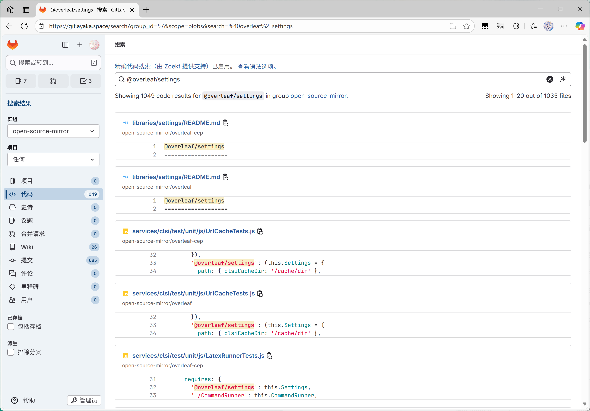
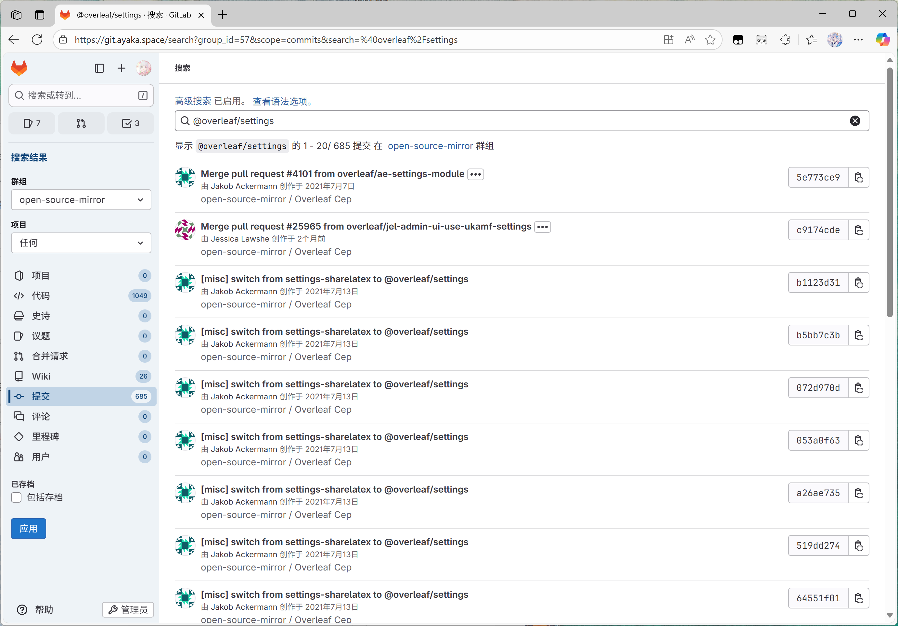
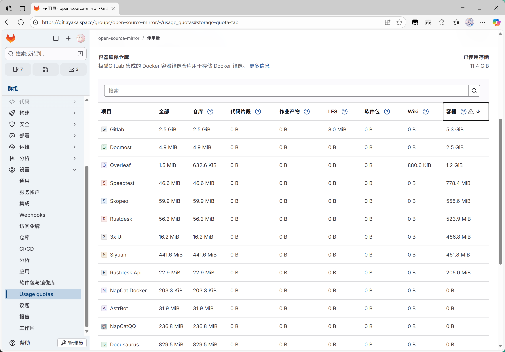
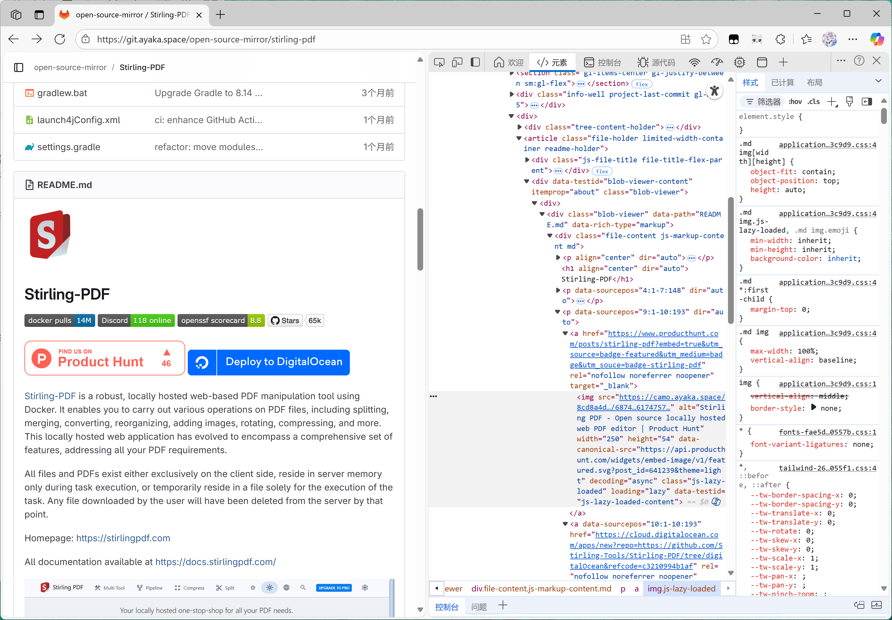
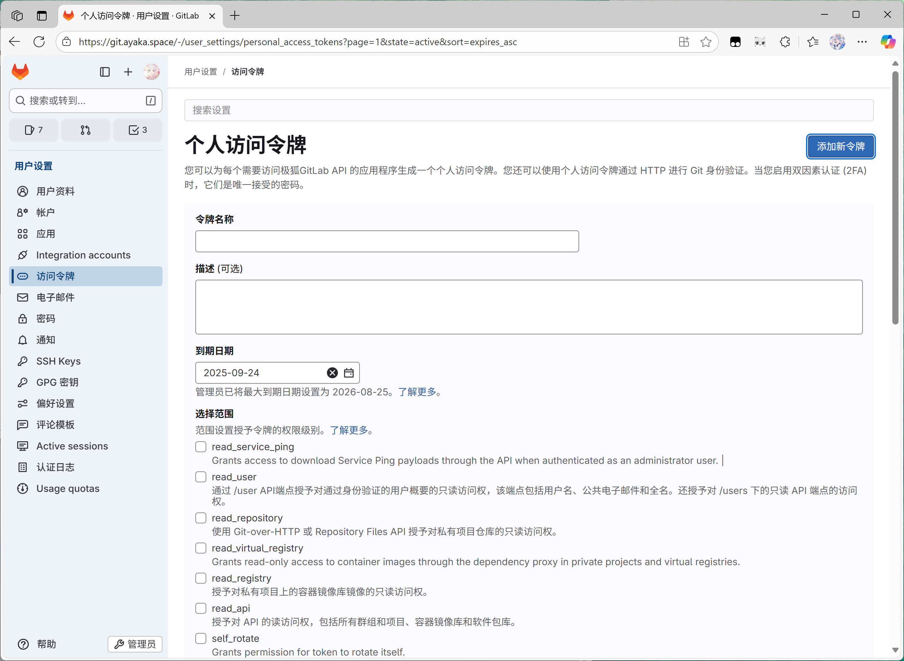
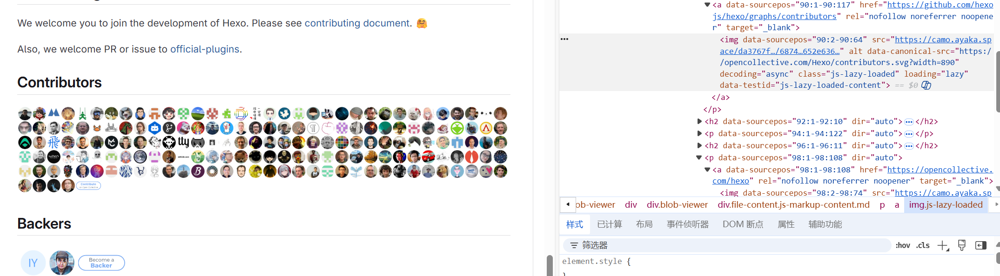
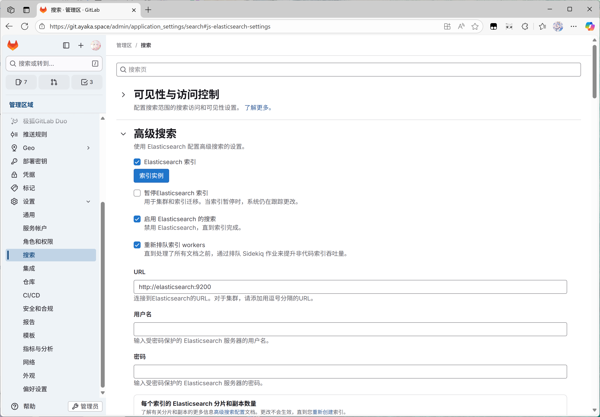
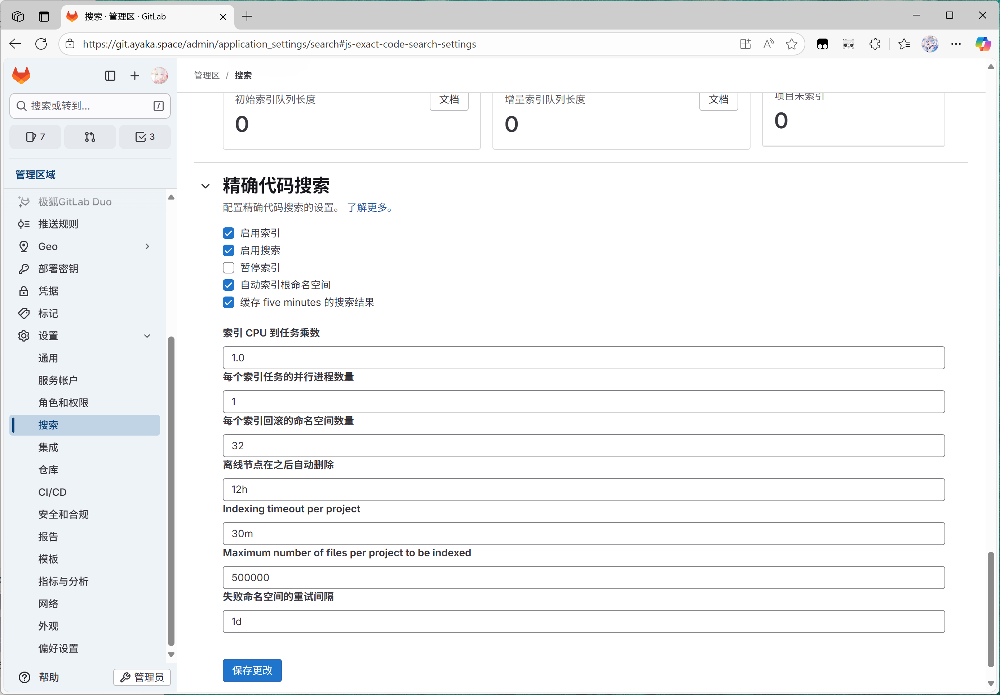

## 连接 Gitlab 和 Elasticsearch/Zoekt 并使用 Docker Metadata 数据库、Camo 代理服务

### 一、简介

#### 1）前提

大家好啊我是 [Musicminion](https://github.com/Musicminion/)。今天这期博客来点小众一点话题——把 Gitlab 接入 ElasticSearch 还有 Zoekt 搜索引擎，以及把 Docker 镜像仓库的 Metadata 迁移到 PostgreSQL 数据库里面。

如果你想要学习 Gitlab 部署，网上还是有不少文章的，这篇文章可能对你不是很适用，因为这个算是比较进阶的内容，**前提是需要有一个你部署好的** **[Gitlab EE (企业版)](https://hub.docker.com/r/gitlab/gitlab-ee/)**  **实例**。关于获取企业版许可证，请参考 [Activate GitLab Enterprise Edition (EE) | GitLab Docs](https://docs.gitlab.com/administration/license/)。

我知道大部分人部署 [Gitlab ](https://gitlab.com/gitlab-org/gitlab)可能纯纯的当做内部协作的代码仓库来使用的，但是其实对于热爱折腾朋友来说，探索应该不止于此。Gitlab 作为一个非常优秀的代码存储工具，功能经过数年的迭代还是非常全的，几乎可以当做一个 All in One 的开发工具，比如下面的内容，网上已经有不少教程：

- Gitlab Pages：个人静态网站部署工具
- Gitlab Docker Registry：容器镜像库
- 配置 Github 集成的单点登录
- CI/CD：流水线和 Runner 的配置
- 其他一些 Bug 的修复等

但是有些比较小众的功能，比如搜索等，这些功能中文教程很少。得对着说明文档一点一点的配置。因此这篇文章介绍一下 Gitlab 的小众功能。

#### 2）搜索功能简介

> Gitlab 的高级搜索还有精确代码搜索都是付费功能，需要企业版许可证。

Gitlab 支持[不同类型的 Gitlab 搜索](https://docs.gitlab.com/user/search/)，比如搜索代码，搜索 Issue、项目名字，这些功能统称搜索。

- 社区 CE 版搜索：只支持最基本的搜索：项目名字等
- Gitlab 高级搜索：可以搜索具体代码、评论、Issue 内容、里程碑
- Zoekt 精确代码：高级搜索的代码不一定准确，Zoekt 可以更精准的搜索到代码（beat 版）

因为我平时个人搜索代码还是很频繁的，你要说为什么不本地 vscode 里面直接搜，那肯定是最快的嘛，但是有时候开发很可能就是想起来了，在浏览器里面顺手一搜索的事，能简化肯定是希望更简化的。

这是不同搜索支持的功能，看完之后是不是很心动：

<table contenteditable="false" spellcheck="false">
    <thead>
        <tr>
            <th colspan="4" rowspan="1">基本搜索 (Basic search)</th>
            <th colspan="4" rowspan="1">高级搜索 (Advanced search)<br></th>
            <th colspan="4" rowspan="1">精确代码搜索 (Exact code search)<br></th>
        </tr>
    </thead>
    <tbody>
        <tr>
            <td><span data-type="strong">范围</span></td>
            <td><span data-type="strong">全局</span></td>
            <td><span data-type="strong">群组</span></td>
            <td><span data-type="strong">项目</span></td>
            <td><span data-type="strong">范围</span></td>
            <td><span data-type="strong">全局</span></td>
            <td><span data-type="strong">群组</span></td>
            <td><span data-type="strong">项目</span></td>
            <td><span data-type="strong">范围</span></td>
            <td><span data-type="strong">全局</span></td>
            <td><span data-type="strong">群组</span></td>
            <td><span data-type="strong">项目</span></td>
        </tr>
        <tr>
            <td><span data-type="strong">Code</span></td>
            <td>No</td>
            <td>No</td>
            <td>Yes</td>
            <td><span data-type="strong">Code</span></td>
            <td>Yes</td>
            <td>Yes</td>
            <td>Yes</td>
            <td><span data-type="strong">Code</span></td>
            <td>No</td>
            <td>Yes</td>
            <td>Yes</td>
        </tr>
        <tr>
            <td><span data-type="strong">Comments</span></td>
            <td>No</td>
            <td>No</td>
            <td>Yes</td>
            <td><span data-type="strong">Comments</span></td>
            <td>Yes</td>
            <td>Yes</td>
            <td>Yes</td>
            <td><span data-type="strong">Comments</span></td>
            <td colspan="3" rowspan="9">No</td>    </tr>
        <tr>
            <td><span data-type="strong">Commits</span></td>
            <td>No</td>
            <td>No</td>
            <td>Yes</td>
            <td><span data-type="strong">Comits</span></td>
            <td>Yes</td>
            <td>Yes</td>
            <td>Yes</td>
            <td><span data-type="strong">Commits</span></td></tr>
        <tr>
        <td><span data-type="strong">Epics</span></td>
        <td>No</td>
        <td>Yes</td>
        <td>No</td>
        <td><span data-type="strong">Epics</span></td>
        <td>Yes</td>
        <td>Yes</td>
        <td>No</td>
        <td><span data-type="strong">Epics</span></td>
        </tr>
        <tr>
        <td><span data-type="strong">Issues</span></td>
        <td>Yes</td>
        <td>Yes</td>
        <td>Yes</td>
        <td><span data-type="strong">Issues</span></td>
        <td>Yes</td>
        <td>Yes</td>
        <td>Yes</td>
        <td><span data-type="strong">Issues</span></td>
        </tr>
        <tr>
        <td><span data-type="strong">Merge requests</span></td>
        <td>Yes</td>
        <td>Yes</td>
        <td>Yes</td>
        <td><span data-type="strong">Merge requests</span></td>
        <td>Yes</td>
        <td>Yes</td>
        <td>Yes</td>
        <td><span data-type="strong">Merge requests</span></td>
        </tr>
        <tr>
            <td><span data-type="strong">Milestones</span></td>
            <td>Yes</td>
            <td>Yes</td>
            <td>Yes</td>
            <td><span data-type="strong">Milestones</span></td>
            <td>Yes</td>
            <td>Yes</td>
            <td>Yes</td>
            <td><span data-type="strong">Milestones</span></td>
        </tr>
        <tr>
            <td><span data-type="strong">Projects</span></td>
            <td>Yes</td>
            <td>Yes</td>
            <td>No</td>
            <td><span data-type="strong">Projects</span></td>
            <td>Yes</td>
            <td>Yes</td>
            <td>No</td>
            <td><span data-type="strong">Projects</span></td>
        </tr>
        <tr>
            <td><span data-type="strong">Users</span></td>
            <td>Yes</td>
            <td>Yes</td>
            <td>Yes</td>
            <td><span data-type="strong">Users</span></td>
            <td>Yes</td>
            <td>Yes</td>
            <td>Yes</td>
            <td><span data-type="strong">Users</span></td>
        </tr>
        <tr>
            <td><span data-type="strong">Wikis</span></td>
            <td>No</td>
            <td>No</td>
            <td>Yes</td>
            <td><span data-type="strong">Wikis</span></td>
            <td>Yes</td>
            <td>Yes</td>
            <td>Yes</td>
            <td><span data-type="strong">Wikis</span></td>
        </tr></tbody></table>
这个是部署好后的效果：

精确搜索：仅适用于代码搜索，并且会在搜索框里面显示：[精确代码搜索（由 Zoekt 提供支持）](https://git.ayaka.space/help/user/search/exact_code_search.md)已启用。如果你用过高级搜索，你会发现高级搜索代码经常**可能会搜出来一堆无关紧要的东西**，精确搜索可以保证搜到的所见即所得。



高级搜索：可以搜索 Wiki、Commit记录等，会提示：[高级搜索](https://git.ayaka.space/help/user/search/advanced_search.md) 已启用



#### 3）容器镜像库 Metadata

如果你已经运营了一段时间的 Gitlab 的容器镜像库，就会发现**你的 Gitlab 数据越来越大**，经过排查我发现是 Gitlab 的容器镜像库默认情况不会自动做垃圾回收（GC）。（即使你通过 Web 界面删除了一个 Docker Image，容器镜像依然存储在你的 Gitlab 中）

有关垃圾回收的教程，请参考 [Running the garbage collection on schedule | GitLab Docs](https://docs.gitlab.com/administration/packages/container_registry/#running-the-garbage-collection-on-schedule)，具体就是运行下面这个命令：

```bash
sudo gitlab-ctl stop  # 停止 gitlab
sudo gitlab-ctl registry-garbage-collect # 运行垃圾回收
sudo gitlab-ctl start # 重启 gitlab
```

注意，Gitlab 的垃圾回收需要停止 Gitlab 服务的运行，不能支持在线回收。那要做到支持在线回收，必须迁移使用 metadata database，也就是把容器的元数据存储到数据库里面。这里推测 Gitlab 之前可能采用了 Docker 官方的 Registry 的方案，后面发现存在种种限制，因此又做了一些数据的迁移工作。

> You can run garbage collection in the background without the need to schedule it or require read-only mode, if you migrate to the [metadata database](https://docs.gitlab.com/administration/packages/container_registry_metadata_database/).

开启了metadata database 后，就可以愉快的统计容器镜像库



#### 4）Camo 代理服务

不知道有没有小伙伴仔细看过 Github 里面引用的一些外链图片的链接。如果你检查过就会发现，所有 Github Readme 引用的外部图片链接，全部变成了`https://camo.githubusercontent.com/`​

> 官方解释：为托管图像，GitHub 使用[开源项目 Camo](https://github.com/atmos/camo)。 Camo 为每个文件生成匿名 URL 代理，以隐藏您的浏览器详细信息和来自其他用户的相关信息。 URL 以 `https://<subdomain>.githubusercontent.com/` 开头，子域不同，具体取决于图像的上传方式。

这样的好处就是，假如有人为了恶意统计用户的访问IP，然后引用于一个自己服务器的图片，这样每次用户打开这个 Readme 的时候，浏览器就会顺着这个图片的URL，去抓取对应的图片，这样就可能导致隐私泄露的问题。

此外，因为国内的一些网络环境不好，一些引用的外网的图片，也可能全部变成了诡异的加载失败，如果能搭建一个自己的图片代理，就会好很多力！

Gitlab 的官方文档其实也是支持 [Proxying assets | GitLab Docs，](https://docs.gitlab.com/security/asset_proxy/)只不过可能很少有朋友关注到了这一点。部署好后的效果如下，可以看到所有的图片全都经过了我的个人 Camo 服务，成功加载：



### 二、部署具体功能

废话不多说，首先介绍一下我自己是使用 Docker-Compose 的 `yml`文件来部署的 Gitlab，我喜欢所有的配置文件集中管理，这样可以很好的迁移。关于 Docker 部署 Gitlab 教程已经烂大街我这里就不需要额外介绍了。

我们三个功能由易到难依次介绍：

#### 1）Camo 代理服务

Github 上有一个开源项目 [cactus/go-camo: A secure image proxy server](https://github.com/cactus/go-camo)，采用 Go 语言编写，同时具有轻量还有高效的特点，并且还提供了 Docker 的部署方式。

我这里是在一台自己的海外服务器上运行的，这是`docker-compose.yml`：

```yml
services:
  go-camo:
    image: ghcr.io/cactus/go-camo:latest
    restart: unless-stopped
    ports:
      - "52380:8080"
    command: ["-k", "somekey"]
```

注意，你应该生成一个自己的密钥，然后用来代替上面的 `somekey`，这个key后面会用来签名使用。然后就是 Nginx 的配置这个也是老生常谈了的：

```conf
server {
    listen 80;
    server_name camo.example.com;

    # 强制跳转到 HTTPS
    return 301 https://$host$request_uri;
}

server {
    listen 443 ssl http2;
    server_name camo.ayaka.space;

    ssl_certificate /path/to/fullchain.cer;
    ssl_certificate_key /path/to/*.example.com.key;

    # 建议加上一些现代 TLS 配置
    ssl_protocols TLSv1.2 TLSv1.3;
    ssl_ciphers HIGH:!aNULL:!MD5;
    ssl_prefer_server_ciphers on;

    location / {
        proxy_pass http://localhost:52380;   # 这里是 docker-compose 里的服务名:端口
        proxy_set_header Host $host;
        proxy_set_header X-Real-IP $remote_addr;
        proxy_set_header X-Forwarded-For $proxy_add_x_forwarded_for;
        proxy_set_header X-Forwarded-Proto $scheme;
        proxy_hide_header Cache-Control;
        proxy_hide_header Expires;
        add_header Cache-Control "public, max-age=3600" always;
    }
}
```

然后需要自己去你的 Gitlab 的个人设置里面，生成一个 PRIVATE-TOKEN 个人访问令牌，权限你可以暂时全部选上，或者勾选 sudo 也行。



然后使用命令行，记得把`<my_private_token>`替换为你的个人访问令牌：

```bash
curl --request "PUT" "https://gitlab.example.com/api/v4/application/settings?\
asset_proxy_enabled=true&\
asset_proxy_url=https://camo.example.com&\
asset_proxy_secret_key=somekey" \
--header 'PRIVATE-TOKEN: <my_private_token>'
```

之后重启 GitLab，你应该就可以看到图片是不是走的你的代理服务器加载的了。



顺便提一嘴，其实这里还可以个性化的配置缓存过期的时间，具体可以参考 Nginx 的缓存时间配置。

#### 2）ElasticSearch 搜索配置

ElasticSearch 是一个 Java 写的全文搜索工具，说实话非常吃性能，没有 16G 的大内存基本很难跑。而且这个东西的 Docker 部署小有复杂。

首先给你的 Gitlab 的 Docker compose的文件里面加上以下内容：

```yml
  elasticsearch:
    image: docker.elastic.co/elasticsearch/elasticsearch:8.10.2
    container_name: elasticsearch
    restart: always
    environment:
      - discovery.type=single-node
      - TZ=Asia/Shanghai
      - xpack.security.enabled=false
      - http.max_content_length=1024mb
    volumes:
      - ./elasticsearch/data:/usr/share/elasticsearch/data
      - ./elasticsearch/config:/usr/share/elasticsearch/config
      - ./elasticsearch/logs:/usr/share/elasticsearch/logs
      - ./elasticsearch/plugins:/usr/share/elasticsearch/plugins
    ports:
      - '9200:9200'
      - '9300:9300'
    mem_limit: 16g
    cpus: '8'
```

然后不要着急，先把容器里面的文件数据偷出来：

```bash
# 启动一个临时容器（不运行服务）
docker run --name temp_elasticsearch -d docker.elastic.co/elasticsearch/elasticsearch:8.10.2 tail -f /dev/null

# 拷贝数据
docker cp temp_elasticsearch:/usr/share/elasticsearch/data ./elasticsearch/data
docker cp temp_elasticsearch:/usr/share/elasticsearch/config ./elasticsearch/config
docker cp temp_elasticsearch:/usr/share/elasticsearch/logs ./elasticsearch/logs
docker cp temp_elasticsearch:/usr/share/elasticsearch/plugins ./elasticsearch/plugins

# 删除临时容器
docker rm -f temp_elasticsearch
```

因为其实是这样的，我们稍后会把这些目录挂载出来，但是实际上这些目录里面本身又有文件了，所以我们必须先把配置偷出来，然后才能运行，特别是像那些插件目录，我们必须挂出来。记得启动后检查一下 ES 的日志，如果发现有问题可能还需要对应的解决。

然后就是熟悉的改配置：

```yml
services:
  gitlab:
    image: gitlab/gitlab-ee:18.3.0-ee.0
    container_name: gitlab
    restart: always
    shm_size: '4g'
    extra_hosts:
      - "host.docker.internal:host-gateway"
    environment:
      GITLAB_OMNIBUS_CONFIG: | 
        # Add any other gitlab.rb configuration here, each on its own line
        # ... 已有的配置
        gitlab_rails['elasticsearch_enabled'] = true
        gitlab_rails['elasticsearch_url'] = ['http://elasticsearch:9200']
        gitlab_rails['elasticsearch_indexer_enabled'] = true
        gitlab_rails['elasticsearch_aws'] = false
```

然后就是进入管理页面配置了：

- 勾选开启 ElasticSearch 索引
- 然后注意URL必须配置为从 Gitlab 容器里面可以访问到的搜索的 URL，为了安全起见可以考虑配置一下密码之类的，我这里仅仅是内部访问，就直接忽略了。
- 配置完成后点`索引实例`，然后静候佳音

​

另外据说还有一个中文的分词器可以考虑一下，方法是进入 Elasticsearch容器里面执行：

```yml
sudo bin/elasticsearch-plugin install analysis-smartcn
```

至于Elasticsearch不停机重建索引，这个一般适用于更新了Gitlab之后，发现搜索搜不了了，或者出现故障的时候，需要重建索引，就点一下，不要点的太频繁。

等所有的项目索引完成，就可以快乐的搜索了！注意，一般**开始索引实例之后，上图里面暂停 ElasticSearch 索引的选项会自动打开，如果你发现索引好了，可以取消勾选然后保存。**

#### 3）Zoekt 精确代码搜索

先简要介绍一下 Zoekt 的架构，Gitlab 和 Zoekt 是怎么配合的？Zoekt 会运行一个 indexer，负责构建索引。Zoekt indexer 启动之后，会去找 Gitlab 一直拉取自己的作业需求，比如知道我现在要索引`/root`下面的所有仓库，然后他就会通过 Gitaly 的 socket 接口去拉取这个对应的数据。这就会导致两个问题：

- Zoekt indexer 需要和 Gitlab 共享数据目录（socket 通信目录等）
- 需要解决权限问题，UID/GID 需要手动配置

此外，Zoekt 会把自己的 URL 通过心跳包的形式发送给 Gitlab，当用户搜索的时候，Gitlab 通过心跳包里面获得的 URL，然后发送给 Zoekt web server。web server 搜索然后返回结果理论是这样。

Gitlab 的 Zoekt 容器的版本和 Gitlab 基本算配套发布的。

关于 Docker compose 部署 Zoekt 的流程，参考这里：[example/docker-compose · main · GitLab.org / Gitlab Zoekt · GitLab](https://gitlab.com/gitlab-org/gitlab-zoekt-indexer/-/tree/main/example/docker-compose)，但是其实这个有些问题，有个环境变量没写会导致一直启动失败。

配置文件里面的几个问题：

1. 你需要找到 gitaly 目录，然后 `ls -ln` 看一下权限，一般 docker 部署的权限号码应该是 998
2. `gitlab_shell_secret`这个文件可能需要你手动去找一下gitlab的这个文件的位置，`find /`一下理论有，我这里也记不清楚，但是你最好拷贝一份放给 zoekt 专门用
3. `git.example.com`就是你的 Gitlab 的 URL
4. 最重要的一个事情：Gitlab 主容器里面的`/var/opt/gitlab`这个挂载到宿主机出后，你需要把挂出来的这个目录，重新挂载到 zoekt 里面去！这样才能保证里面可以通过 socket 文件访问 gitaly，因为需要拉取仓库数据。

```yml
   gitlab:
     # 其他配置
     volumes:
      - './gitlab/config:/etc/gitlab'
      - './gitlab/logs:/var/log/gitlab'
      - './gitlab/data:/var/opt/gitlab' # 注意观察 /var/opt/gitlab 的挂载点

 # registry.gitlab.com/gitlab-org/build/cng/gitlab-zoekt:v18.2.4-fips
  zoekt_webserver:
    image: registry.gitlab.com/gitlab-org/build/cng/gitlab-zoekt:v18.3.0
    container_name: zoekt_webserver
    restart: always
    # 998 is the UID for ./gitlab/data/git-data/repositories/+gitaly
    # use ls -ln to check
    user: "998:998"
    ports:
      - 6070:6070
    environment:
      GITLAB_ZOEKT_MODE: webserver
      WEBSERVER_PORT: 6070
      GITLAB_URL: https://git.example.com
      GITLAB_ZOEKT_SELF_URL: "http://zoekt_webserver:6070"
      GITLAB_ZOEKT_VERSION: "v18.3.0"
      GITLAB_ZOEKT_SECRET_PATH: /.gitlab_shell_secret
      ZOEKT_ENABLE_DEBUG_LOGGING: true
    volumes:
     - ./zoekt/zoekt_index_data:/data/index
     - ./zoekt/.gitlab_shell_secret:/.gitlab_shell_secret
     - ./gitlab/data:/var/opt/gitlab # 注意模拟挂载到 /var/opt/gitlab
    depends_on:
      - git.ayaka.space

  zoekt_indexer:
    image: registry.gitlab.com/gitlab-org/build/cng/gitlab-zoekt:v18.3.0
    container_name: zoekt_indexer
    restart: always
    # 998 is the UID for ./gitlab/data/git-data/repositories/+gitaly
    # use ls -ln to check
    user: "998:998"
    ports:
      - "6065:6065"
    environment:
      GITLAB_ZOEKT_MODE: indexer
      SERVICE_URL: http://zoekt_indexer:6065
      WEBSERVER_PORT: 6070
      GITLAB_URL: https://git.example.com
      GITLAB_ZOEKT_SELF_URL: "http://zoekt_webserver:6070"
      GITLAB_ZOEKT_VERSION: "v18.2.4"
      GITLAB_ZOEKT_SECRET_PATH: /.gitlab_shell_secret
      ZOEKT_ENABLE_DEBUG_LOGGING: true
    volumes:
     - ./zoekt/zoekt_index_data:/data/index
     - ./zoekt/.gitlab_shell_secret:/.gitlab_shell_secret
     - ./gitlab/data:/var/opt/gitlab # 注意模拟挂载到 /var/opt/gitlab
    depends_on:
      - git.ayaka.space
    mem_limit: 8g
    cpus: '4'
```

这些工作做完之后，你就可以启动 zoekt，先看容器是否是正常启动的。然后你先可以进入 Web 界面开启：



在默认情况 Gitlab 18.2.4 之前，他默认只会给新的Group或者用户开启这个搜索，不会开启之前旧的名字空间的索引作业的，需要手动指定。比如`<top-level-group-to-index>`改成你的`root`，就可以索引当前root用户下面的项目。

参考链接：[Zoekt chart | GitLab Docs](https://docs.gitlab.com/charts/charts/gitlab/gitlab-zoekt/?tab=GitLab+17.7+and+later#configure-zoekt-in-gitlab)

```bash
# 需要进入 gitlab 容器然后执行下面的命令
gitlab-rails console
node = ::Search::Zoekt::Node.online.last
namespace = Namespace.find_by_full_path('<top-level-group-to-index>')
enabled_namespace = Search::Zoekt::EnabledNamespace.find_or_create_by(namespace: namespace)
replica = enabled_namespace.replicas.find_or_create_by(namespace_id: enabled_namespace.root_namespace_id)
node.indices.create!(zoekt_enabled_namespace_id: enabled_namespace.id, namespace_id: namespace.id, zoekt_replica_id: replica.id)
```

处理好后你应该可以看到索引已经重新建立，然后可以在 Web 界面愉快的搜索了。
