## 从群晖 DS 925+ 重新思考 NAS

> 内部跟踪 Issue 链接：[2025.09 Week 1: 记录一下自己使用一天的群晖 NAS 感受 (#18) · Issue · Musicminion/personal-plan](https://git.ayaka.space/Musicminion/personal-plan/-/issues/18)

### 一、背景

#### 1）故事的起因

几乎所有的 Nas 玩家都在抱怨群晖的性能差，但是说真的我几乎在互联网上没有见到任何一个对 Nas 的性能做一个比较客观的性能评价的文章。比如客观说我用 Nas 跑了什么然后发现性能不可以的。大部分人对于群晖的评价就是性能烂，不如绿联、不如威联通、不如 XXX，但是实际上也没有一个详细的数据来说，什么东西群晖干不了的其他的 XX 可以干。（抛开核显这种视频解码的功能）

说实话近半年以来一直想要买个 Nas，用虚拟机或者 Docker 研究群晖的 DSM 系统也算是捣鼓了小几个月了，但是一直有几个问题：

- 大家都说群晖性能差，但是 2025 年群晖全系列高端一点的机型全部采用了 V1500B，这个 CPU 到底如何，能做什么工作？
- 群晖的 DSM 系统可以运行什么虚拟机，性能到底如何，而官网的功能体验过于局限，虚拟机没法试用？
- 群晖 25 系列的都实行了锁盘制度，到底对于新机器怎么才能用上自己的硬盘？
- 网上说群晖 ds925 以上的型号，其实可以支持 64GB 的内存，到底是不是可以？

所以一不做二不休，干脆京东买了一个 群晖 DS 925 的 NAS，先说为什么买了这个：

- 我自己家里没有万兆设备接口的电脑，买万兆也是纯眼馋
- 说到底 Nas 还是贵在硬盘，五盘位四盘位，差别没那么大
- 从 925 以上型号的 nas 的 CPU 全是 V1500B，比起型号其他盘位，我更好奇这个 CPU 怎么样？

因此抱着这样的好奇心我在 8 月 31 号的中午就下单了：

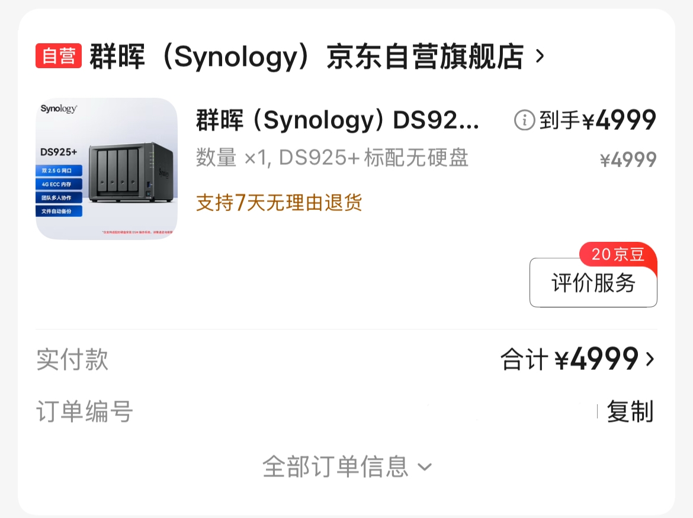​

#### 2）买前了解的信息

**说说 CPU**：其实在故事开始之前我还有点想说说 V1500b 这个 CPU，其实你如果参考：[如何查找 Synology NAS 的 CPU 型号？ - Synology 知识中心](https://kb.synology.cn/zh-cn/DSM/tutorial/What_kind_of_CPU_does_my_NAS_have)，就会发现其实不少高端机型（比如售价 2w/3w 的机架式 Nas）都在用这个所谓的 V1500B，甚至威联通有些机型也是如此。

|**型号**|**CPU 型号**|**核心数（单一 CPU）**|**线程数（单一 CPU）**|**FPU**|**套件架构**|**RAM**|
| :-: | ----------------| -| -| --| -------| --------------------|
|**DS1825+**|AMD Ryzen V1500B|4|8|✓|V1000nk|DDR4 ECC SODIMM 8 GB|
|**DS1525+**|AMD Ryzen V1500B|4|8|✓|V1000nk|DDR4 ECC SODIMM 8 GB|
|**DS925+**|AMD Ryzen V1500B|4|8|✓|V1000nk|DDR4 ECC SODIMM 4 GB|
|**RS822+RS822RP+**|AMD Ryzen V1500B|4|8|✓|V1000|DDR4 ECC SODIMM 2 GB|

当然咯，作为消费者我们肯定还是希望群晖把那些 FS6400 这种配置屌爆的 10 几个核心的 CPU 下放到民用的型号上面来，毕竟随着现在的发展，Nas 市场也是越来越卷，软件做好的同时硬件到位，才能让家用顾客信服嘛。但是群晖一直都是买软件送硬件的特性，说真的在今天这个局面显得很尬。

**说说锁盘政策**：我其实觉得锁盘策略这个没有任何可以说洗白的，**和那些淘宝日代服装手办的店铺遇到的跑单的顾客一样，就是没有信誉**。虽然网上一堆人说，是暂时只能用群晖的盘，但是从群晖发布 ds925+ 系列到今天，官网显示的[兼容性列表 | 群晖科技 Synology Inc.](https://www.synology.cn/zh-cn/compatibility?search_by=drives&model=DS925%2B&category=hdds_no_ssd_trim)就是只有群晖的硬盘。对于花费了大价钱购买曾经旧型号的第三方盘的顾客，是非常有损信誉还有让人恼火的。

对于大众心里也明白，群晖自己也在试试水，看看能不能从硬盘这个角度再爆一把垄断的金币。如果市场真的不好，他在拱手把希捷、WD 这些硬盘的型号加入到兼容性列表里面就可以了，毕竟这玩野也没有什么技术含量，本身就是一个本地脚本修改数据库的事情。

但是客观来说，群晖对于全新安装的机器，只限制了机械盘的型号，对于 SATA 固态，还是可以顺利安装系统的，这点我在 B 站的视频里面有所看到。所以我也直接就插上了自己的 980evo 的固态盘。

---

既然想测，那就狠狠地测试一番吧，于是啪的一下就有了后文。

### 二、开箱和实测

#### 1）包装

我是在京东自营群晖自营店买的 Nas，买来就是这个样子，发货甚至连一个外包装都没有，裸的机器，甚至最让人生气的是**直接拿着粘胶绕着箱子缠了几圈就发来了**。说实话这个可是 4999 块钱的 Nas 啊，就这样一个态度嘛。

然后我花了很大力气，小心翼翼的吧所有的胶带全部都撕掉了。然后还原成这个样子，注意一下：这个其实是有密封的包装，这个密封标签在箱子的开口处。

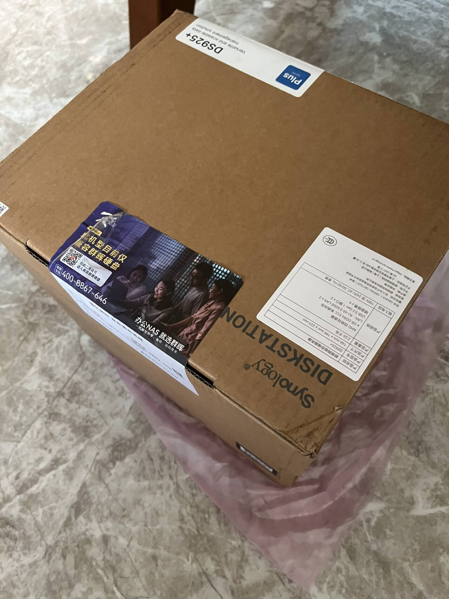​

说实话我感觉京东自营的快递很一般，尤其是包装这一块。就感觉是直接拿着货物到处飞，反正也不担心退货咯，退货估摸也有包装二次打包一下再去卖的。

#### 2）拆箱和加装硬盘、内存

买来小心翼翼的把包装撕掉，然后换上了我笔记本 **64GB** 的内存（2x32G，DDR4）：

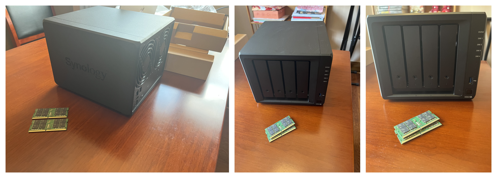​

然后关于硬盘 我采用了一块三星的 512GB 的 870 EVO。因为我不是很确定自己是否需要这个 Nas，而且为了避免拆封硬盘给商家带来的额外麻烦，我就干脆自己准备。

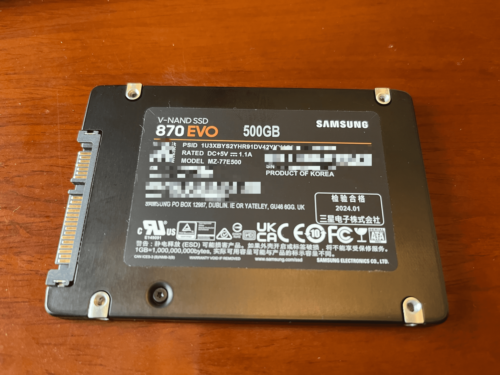​

另外其实我在 B 站做功课的时候就发现，有人已经买了 DS925 这种机器，然后用 sata 固态盘就可以**绕过安装时候的硬盘检查限制**。因此不如试一试。​​

关于群晖的硬盘架：其实是支​持 3.5 寸的大硬盘，还有这种小的 SATA 盘，因为我没有拍图片，安装小的这种 2.5 寸的盘，需要把硬盘架下面的一个橡胶支架给卸掉。

但是比较意外的是，我没有自己的螺丝，后来我干脆一不做二不休，直接把盘插到里面去。然后把硬盘架稍微支撑一下放进去就好了。群晖赠送的配件里面实际上是有密封包装的螺丝，但是我想了一下还是尽量不要拆开。

然后就是熟悉的安装系统环节了，说真的，这个裸机摸着挺塑料感，算上箱子电源配件快递重 3kg，实际裸的机器可能就 1kg 出头一点，里面抛开硬盘支架也就是个空荡荡的壳子，这个硬盘支架也摸着颇有塑胶感（从不专业的角度评价就是这样）一块主板可以接四个硬盘/SATA 固态盘。

其实这么一想又觉得 4999 自己买了一个寂寞，这么一个铁盒子 + 主板怎么都不值得这个价吧？有兴趣的可以去看看拆解视频：[https://www.bilibili.com/video/BV1Md4y147xG](https://www.bilibili.com/video/BV1Md4y147xG)

<iframe src="https://player.bilibili.com/player.html?isOutside=true&amp;aid=390756221&amp;bvid=BV1Md4y147xG&amp;cid=911796731&amp;p=1&amp;autoplay=0" data-src="//player.bilibili.com/player.html?isOutside=true&amp;aid=390756221&amp;bvid=BV1Md4y147xG&amp;cid=911796731&amp;p=1" scrolling="no" border="0" frameborder="no" framespacing="0" allowfullscreen="true" style="width: 777px; height: 410px;"></iframe>

#### 3）安装系统

进入系统可以完美，不会有硬盘的兼容性：

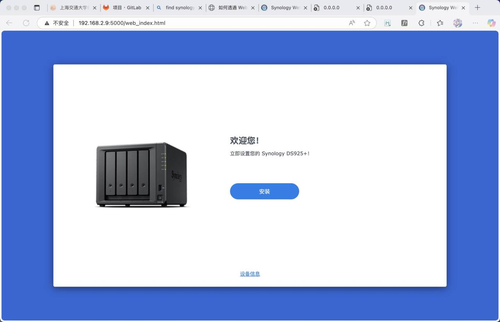​

安装进行中：

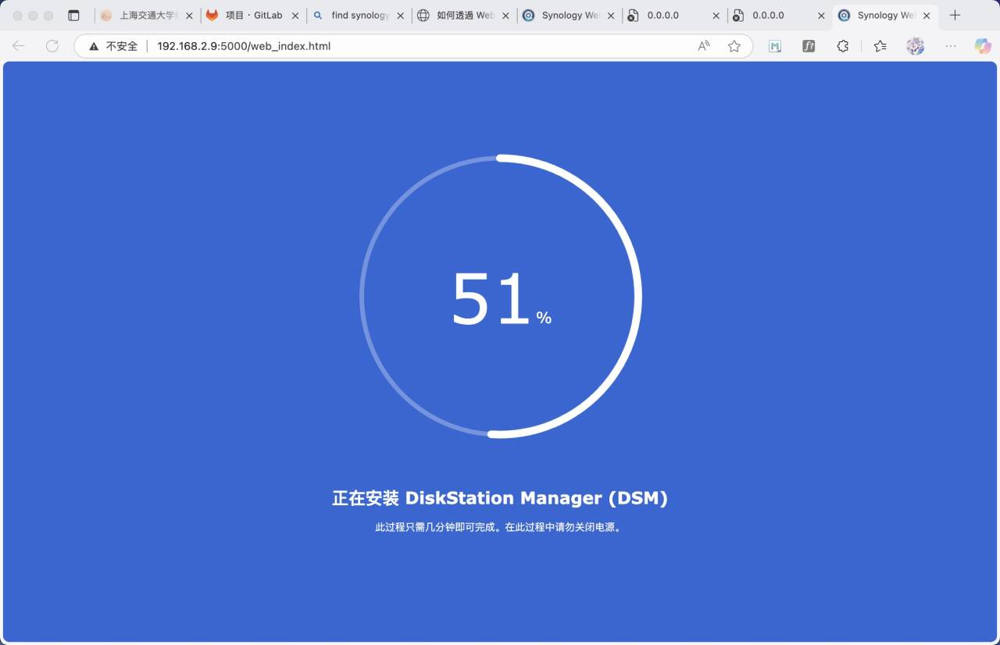​

安装完成，会疯狂提示你的存储池没有验证，很蛋疼：

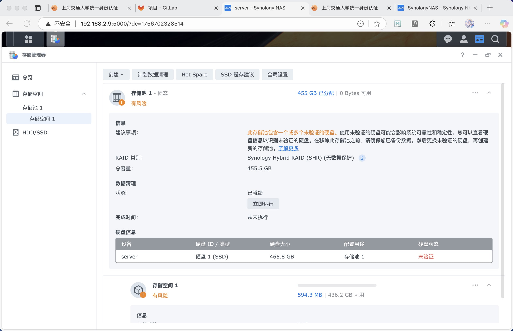​

另外补充一下，群晖的 64 GB 内存也是可以完美兼容的：

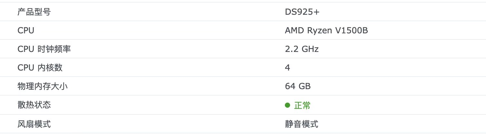​

#### 4）说说虚拟机 CPU 性能

然后说说这个东西的 CPU 性能吧，我个人用 ubuntu 用的比较多，所以就安装了一个 ubuntu 24 的虚拟机。

先说结论：能用，Docker 还行，但是虚拟机 VMM 很卡，很不好用：

- 我给虚拟机分配了 2 核心，8GB 的 CPU 和内存
- 单说安装 ubuntu 都耗时快半个小时
- 在此基础上我还运行了一些套件安装，同时给机器在解压一个 tar

此时的机器资源占用如下：

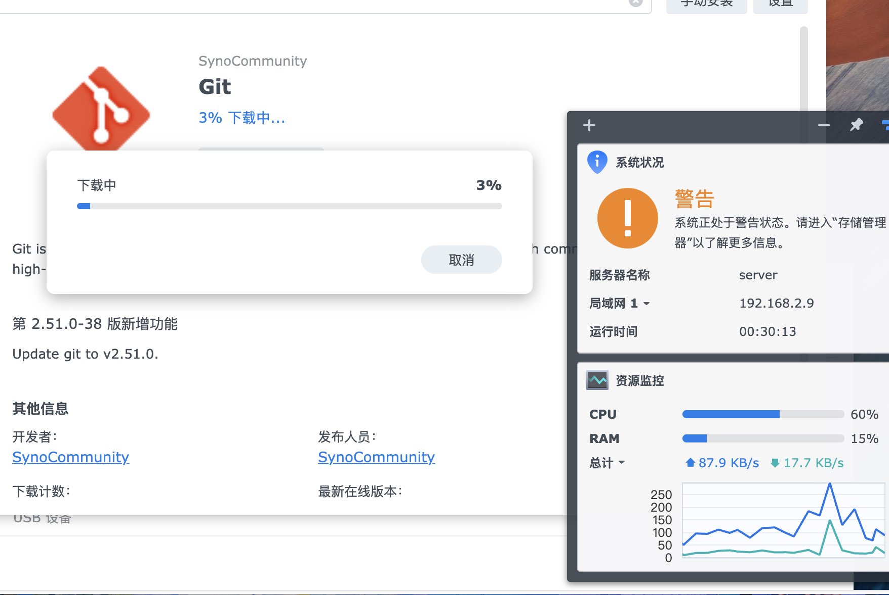​

安装好虚拟机大概这样，勉强算能比较流畅的运行：

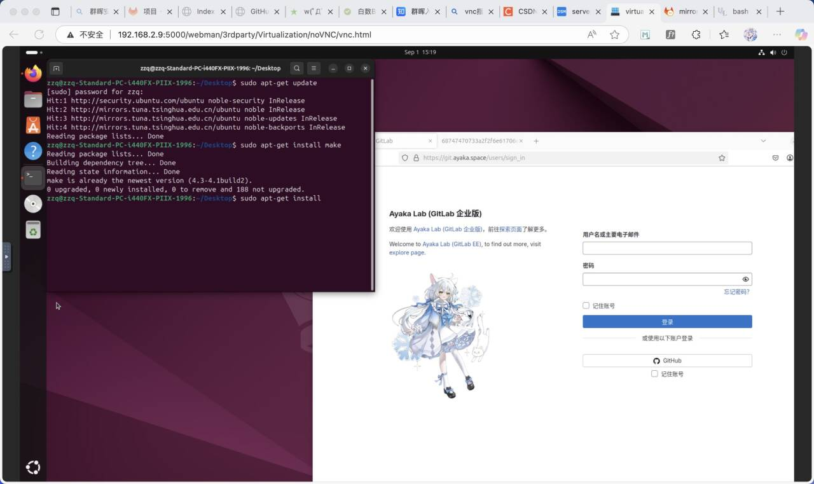​

**小结**：群晖这个虚拟机并不适合有图形界面的，比如 Ubuntu 的虚拟机，因为虽然是 4 核 8 线程，但是 CPU 降频了，所以就会导致稍微重一点的任务（甚至 ubuntu 安装）这种都有些费力，鼠标移动稍微有一些卡顿，勉勉强强。

如果硬要说极限，对于 ds925+，可能最多运行两个 2 核心、8GB 的 Ubuntu 虚拟机，然后开一个 Gitlab，机器就属于 100% CPU 负载的情况了。所以群晖官网所叙述的 VMM 可以运行 8 个虚拟机，在这个里面并不现实。

关于 Windows，我没有测试，但是估计够呛，所以也没有测试的必要了。

虚拟机的日常的资源占用，其实我觉得还不错：

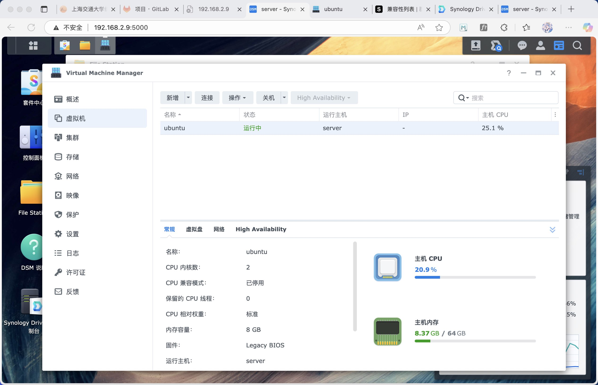​

**介绍一下我自己的 Gitlab：**

我自己的 Gitlab 是一个非常 heavy 的应用，我部署了 ElasticSearch、Zoekt 等附加 Docker 应用，为我的 Gitlab 提供索引还有搜索等支持，此外还有 frpc 作为代理。但是说实话，哪怕我在运行这个 Gitlab 还有一个 2 core + 8 GB 的虚拟机，都是可以流畅运行的。CPU 大概在 50%，内存占用大概在 30%。我之前在 Reddit 发了一个问题问外网的朋友们，大家都说不可以运行，像你这种 Gitlab + ElasticSearch 的大型 app，甚至还想要开一个虚拟机，那肯定跑不了。**但是实测效果还是比较惊喜**。

比较离谱的是，我用命令行 `htop` 发现机器实际上是有 8 个核心的！而且实测也算比较理想。但是唯独比较难以接受的是虚拟机估计也是降频运行了的，性能一般。

### 三、一些主观评价

#### 1）**从程序员角度说**

其实我还要补充一个小插曲，我在解压我 100G 的 gitlab 归档数据的时候，我想下载一个 `pigz` ，但是比较恼火的是系统本身并没有所谓的 apt 的支持，哪怕是 ipkg 也没有 pigz 的安装包，所以导致我使用 `pigz` 并行压缩的 `tar.gz` 无法成功的解压，我估摸还是软件的 bug。另外可能有人问我为什么不用自带的，因为我需要保证 gitlab 文件系统的 uid/gid 必须原封不动的从一台机器迁移到另外一台机器，所以使用 tar 的时候，必须加上额外的 numeric owner 的标识。

同样，说到 Docker，群晖的 Container Manager 里面的是 `docker-compose` ，而不是 `docker compose`，而且不能自动创建挂载的目录，说实话这个很恶心。对于我 yml 文件里面有数十个挂载的文件全部要手动 mkdir，简直是噩梦。

但是转念一想，或许群晖提供的这个容器界面，就是一步步引导那些不太会 Docker 的人，逐步体验配置一个软件的乐趣呢？虽然对我来说我宁 `docker run` 一键搞定，但是对于喜欢对着知乎里面，图片教程一步步点击的人，或许有个界面就方便很多了。

#### 2）总结

总的来说，群晖这个 Nas，其实性能也就是中规中矩。买来玩 Docker、备份相册、存存文件，当做网盘使用，基本都是没有任何问题。但是一旦你要拉扯上虚拟机，那就其实很难做好朋友了。这是服务器干的事情，他干不好，也很难干好。4999 的价格，买这么一个方盒子里面几块板子（哈哈），肯定不值这个硬件的价格，但是这个盒子是否值得大家的软件备份、数据安全的价格呢，我觉得可以另外考虑。

我实验室里面放了一个 Nas，型号是 ds418 play（具体可以看下图），说真的你光看这个外表就知道已经是身残志坚了，全都是灰尘。但是某一天我把他打开启动，发现依然可以使用，里面甚至存储了我小导师的四五年前的毕业论文，光是说这个你就知道他有多么的稳了。

但是**吹牛说他稳定归稳定，现实该吃灰依然还是吃灰**。说实话问一问我们实验室的同学，大家鲜有人知道实验室的机柜里面居然还有一只群晖的 Nas，里面安放了一个 8TB 的硬盘。不知道多年以前实验室的弟兄们遇到放假前夕是不是把 nas 拿出来，一块播一场电影......其实说到底，吃灰还是说明这个东西不常用，或者没什么用，再或者大家不习惯用。

打开一看，目前硬盘里面也就存储了我们实验室各类毕业人士的毕业论文还有代码，偶尔还有几台服务器上面的备份数据。对于平时团队的协作开发，服务器，足矣。线下的数据传递，一个 U 盘或者移动硬盘，足矣。那为什么要一个 Nas 呢？备份，备份，也只有备份了。时间一长，自然沦落到角落里面，加上没有专门的人维护管理，吃灰是自然的。

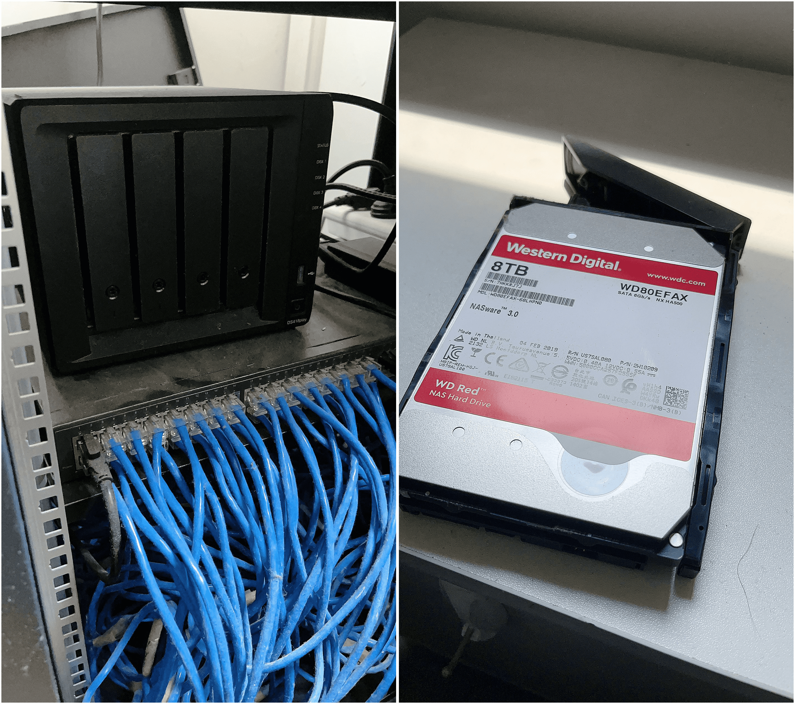​

这些年啊，也不知道是从何时开始，“私有云”这个词越来越火。仿佛随着网盘收费、内容监管和审查越来越严，一夜之间那些卖私有云的厂家就开始疯狂鼓吹 Nas 的好处。但是其实仔细一想，不少人买网盘会员，其实说到底并没有多少自己的重要数据要存储，反倒是为了下载所谓的小道破解资源，而被迫购买下载的会员。这样就算买回来 Nas，也依然治标不治本。

这么说来，很多 Nas 最终也只是落到一个吃灰的结局，说到底还是因为：

1. 从性能说：Nas 相比服务器**比上不足**，相比裸硬盘盒**比下有余**，很尴尬的定位。需要性能的选了前者，需要备份的果断选了后者，需要情绪价值的选择了 Nas。
2. 从用途说：抛开团队协作存储、影视 + 剪辑需求，个人折腾 home lab，相册备份，**用途过于极限。另外，如果没有足够的网络拓扑架构支撑，很难发挥出 Nas 的效益。** （就拿最简单的，没有公网 IP/内网穿透，你的 Nas 就是一块家里的板砖；没有足够的万兆办公网络支撑，想要发挥 4K 剪辑性能，也很困难，而这些远超过 Nas 自身 + 硬盘的成本；此外要发挥满血性能，还得给办公环境里面的每个电脑都升级到万兆网卡的支持；但是现在市面电脑除开苹果，又有多少自带万兆的接口呢？这么一来成本其实更高）
3. 从用户群体说：专业的程序员觉得繁琐（比如群晖的 volume 不能自动创建，版本过低；对着界面一点点填写 image name、port 填还不如命令行粘贴回车来的实在，但是命令行又很多功能不支持，陷入两难），普通的用户群体需要学习（需要有 step-by-step 的图片引导教程），不少新手期过了就失去了热情。
4. 从使用场景说：家用的用户一味的需要性能、解码；企业的用户需要好用的软件 + 稳定；而卖 Nas 的需要研发软件的同时，想要节省成本、扩大收益，这就造成了一个微妙的三角关系

如果要一句话总结：

👉 **NAS 的核心困境在于“低成本 Cost—高性能 Performance—好体验 Experience”三角关系**，所以你发现很多 Nas 只能满足 3 个里面的 2 个。

- 用户买 Nas 既要性能，又要好的体验（关注 PE，忽略了 C）
- 折腾黑群晖的用户发现自己获得了（CP），但是升级和遇到故障，却损失了（E）
- Nas 研发：需要控制成本，还要给用户好的体验（关注 CE，只能损失 P）
- 新入厂家：软件不够，生态不稳，只能硬件加码来凑，所以只能满足（关注 CP，损失了 E）

所以这就是为什么当下的 Nas 局面这么尴尬了的原因吧，并不是群晖一家独大，而是这样的一个三角关系确实很难满足。至于顾客，也只能根据自己的想法投票了罢。黑白群、绿联威联通还是自建，八仙过海各显神通。

当然我也相信，既然群晖曾经的机架 V1500B 也能下放到 ds925 这种家用 nas，说不定哪一天群晖 FS6400、FS3600 这种八核、十二核的 CPU，也能下放到民用呢？那就是很远的将来力罢......

‍
