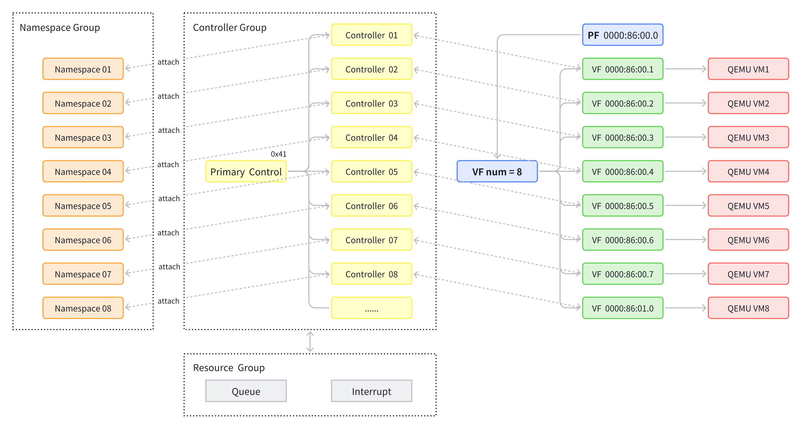

## 给 P1735 等 NVMe 开启 SR-IOV 虚拟化直通虚拟机

> 最近要跑虚拟化的实验，所以就写了这篇文章。之前没有做过 SR IOV 有关虚拟化的研究，所以对 SR IOV 的操作也不算很熟悉，因此这个博客就当一个新手教程来吧！
>
> 另外其实我折腾过程中，发现 SSD 的固件也和 SRIOV 有很大的关系，所以如果可以的话尽可能用最新版的 SSD 固件。

### 一、前置条件

要支持 SR IOV 需要几个前置条件：

- 需要 SSD 固态支持，比如三星的 P1735，但是傲腾的 P4510 就不支持，具体可以网上搜型号
- 需要开启 `intel_iommu=on iommu=pt`，具体目录在 `/etc/default/grub` 里面（具体效果如下）

```bash
user ➜ ~ $ cat /etc/default/grub
# If you change this file, run 'update-grub' afterwards to update
# /boot/grub/grub.cfg.
# For full documentation of the options in this file, see:
#   info -f grub -n 'Simple configuration'
#GRUB_DEFAULT=0
GRUB_DEFAULT=''
GRUB_TIMEOUT_STYLE=menu
GRUB_TIMEOUT=15
GRUB_DISTRIBUTOR=`lsb_release -i -s 2> /dev/null || echo Debian`
GRUB_CMDLINE_LINUX_DEFAULT="quiet splash"
GRUB_CMDLINE_LINUX="quiet text ignore_loglevel page_alloc.shuffle=Y console=ttyS0,115200 console=tty0 intel_iommu=on iommu=pt scsi_mod.use_blk_mq=1 pcie_acs_override=downstream,multifunction"
```

然后我们检查一下当前 NVMe 设备的状态，可以清晰的看到 P1735 在 `/dev/nvme0n1` 的槽位：

```bash
zzq ➜ ~/cloud-images (master) $ sudo nvme list
Node                  SN                   Model                                    Namespace Usage                      Format           FW Rev  
--------------------- -------------------- ---------------------------------------- --------- -------------------------- ---------------- --------
/dev/nvme0n1          S55JNE0NB00453       SAMSUNG MZPLJ1T6HBJR-00007               1           1.60  TB /   1.60  TB    512   B +  0 B   EPK9GB5Q
/dev/nvme1n1          PHLJ949300D91P0FGN   INTEL SSDPE2KX010T8                      1         998.58  GB / 998.58  GB    512   B +  0 B   VDV10131
```

### 二、开启 SR IOV 步骤

刚刚我们看到 P1735 只有一个 Namespace，对于大部分刚开始的情况也是这样的。要开启 SR-IOV，并通给 $m$ 个虚拟机，我们需要做一下事情：

- [ ] 根据需要升级 NVMe 的固件（选做，我更新后用的固件是 EPK9GB5Q，小于这个版本会有问题）
- [ ] 清空 NVMe 盘上面的所有已有的 Namespace
- [ ] 创建  $m$ 个 VF
- [ ] 创建  $m$ 个 Namespace，把创建的  $m$  个 Namespace 以此绑定到   $m$  个控制器
- [ ] 为 这 $m$ 个控制器个控制器分配队列、中断资源
- [ ] 加载 `vfio` 相关的内核模块
- [ ] 启动 `qemu` 虚拟机然后检查

另外补充：**P1735 的老版本固件开启 SR IOV 会有问题**，具体为开启虚拟机后，虚拟机内 `lspci` 可以看到设备，但是 `nvme list` 就是空白。

请参考下面的链接：[GitHub P1735 固件更新](https://github.com/linux-nvme/nvme-cli/issues/1126#issuecomment-1318278886)，安装固件的脚本是：

```bash
sudo nvme reset /dev/nvme0
sudo nvme fw-download /dev/nvme0 --fw=General_PM1733_EVT0_EPK9GB5Q.bin
sudo nvme fw-commit /dev/nvme0 -s 0 -a 1
sudo nvme reset /dev/nvme0
sudo nvme id-ctrl /dev/nvme0 | grep fr
```

为了辅助大家理解，我这里又画了一个图（帮助新手理解）：

- 首先，一个 NVMe 盘可以有很多个 Namespace，比如我们看到的 `n1p1`​，其中 `n`​ 就代表的是名字空间（`p` 表示分区我们这里不用考虑）。对于 SRIOV 通常需要把一个盘分成多个 Namespace 来隔离，每个虚拟机访问自己的名字空间
- 然后，对于大部分常见的 NVMe，只有一个控制器，对于支持 SRIOV 的 NVMe，比如 P1735，甚至有高达 60 多个控制器，这些控制器里面有一个是 Primary 主控制器（一般编号很高，比如 `0x41`），然后剩下的都是 Secondary 二级控制器，这些二级控制器一般编号比较低，用于虚拟化
- 要查看二级控制器，可以用命令：`sudo nvme list-secondary /dev/nvme0`，这个命令非常重要！可以看是否在线
- 当我们正常用一个 NVMe 盘的时候，通常就一个 Namespace，我们把 N1 绑定到 Primary 控制器，即可通过 `nvme list` ​看到这个盘。当我们用 SR IOV 的时候，会有多个 Namespace，需要给每个 Namespace 手动 attach 绑定到对应的控制器。
- VF 表示虚拟的 PCI 接口，可以用来提供给虚拟机，比如我们虚拟出来八个虚拟机，就会把 SR IOV 卡虚拟的接口暴露给 QEMU，PF 表示物理接口上运行的功能。有一个注意的：VF 的最后一位从 1 开始，然后增长到 7 为止就需要进位。
- 二级控制器 01 默认就对应 VF01，以此类推，比如这个 P1735 有 32 个 VF，所以二级控制器就对应 1~32。



### 三、清空旧的所有 Namespace

首先，我们可以用下面的脚本查看所有的控制器：

```bash
for n in $(sudo nvme list-ns /dev/nvme0 -a | sed -n 's/.*]:0x\([0-9a-fA-F]\+\)/\1/p'); do   echo "NS $n:"; sudo nvme list-ctrl /dev/nvme0 -n $n; done
```

输出结果如下，可以看到 NS 0（Namespace，后面缩写） 绑定到了 `0x41` ​的控制器：

```bash
zzq ➜ ~/cloud-images (master) $ for n in $(sudo nvme list-ns /dev/nvme0 -a | sed -n 's/.*]:0x\([0-9a-fA-F]\+\)/\1/p'); do   echo "NS $n:"; sudo nvme list-ctrl /dev/nvme0 -n $n; done
NS 1:
num of ctrls present: 1
[   0]:0x41
```

然后需要 detach 掉 NS 0，然后删除掉 NS 0：

```bash
 sudo nvme detach-ns /dev/nvme0 -n 1 -c 0x41
 sudo nvme delete-ns /dev/nvme0 -n 1
```

### 四、创建 VF

我们找到 NVMe 硬件的 PCI 地址，这个叫做 PF（Physics Function）。我这里输出是 `0000:86:00.0`。

```bash
# 找到 nvme0 对应的 PCI 设备地址（PF）
PF=$(basename "$(readlink -f /sys/class/nvme/nvme0/device)"); echo "$PF"
# 查看该设备的 SR-IOV 总 VF 能力（>0 表示支持）
cat /sys/bus/pci/devices/$PF/sriov_totalvfs
# 输出 32
```

创建并启用 VF（示例创建 8 个）

```bash
# 启用 8 个 VF
echo 8 | sudo tee /sys/bus/pci/devices/$PF/sriov_numvfs
# 验证 VF 已生成（应该可以看到 8 个）
ls -l /sys/bus/pci/devices/$PF/virtfn*
# 查看 VF 的 PCI 地址
for v in /sys/bus/pci/devices/$PF/virtfn*; do basename "$(readlink -f "$v")"; done
# 0000:86:00.1
# 0000:86:00.2
# 0000:86:00.3
# 0000:86:00.4
# 0000:86:00.5
# 0000:86:00.6
# 0000:86:00.7
# 0000:86:01.0
# 以后如果需要关闭 VF，可以执行
# echo 0 | sudo tee /sys/bus/pci/devices/$PF/sriov_numvfs
```

### 五、创建 Namespace

用下面的命令创建八个 Namespace，大小均为 40G（具体计算方法可以用逻辑块大小）

```bash
sudo nvme create-ns /dev/nvme0 -s 78125000 -c 78125000 -f 0 -d 0
```

输出结果：

```bash
zzq ➜ ~ $ sudo nvme create-ns /dev/nvme0 -s 78125000 -c 78125000 -f 0 -d 0
create-ns: Success, created nsid:1
zzq ➜ ~ $ sudo nvme create-ns /dev/nvme0 -s 78125000 -c 78125000 -f 0 -d 0
create-ns: Success, created nsid:2
zzq ➜ ~ $ sudo nvme create-ns /dev/nvme0 -s 78125000 -c 78125000 -f 0 -d 0
create-ns: Success, created nsid:3
zzq ➜ ~ $ sudo nvme create-ns /dev/nvme0 -s 78125000 -c 78125000 -f 0 -d 0
create-ns: Success, created nsid:4
zzq ➜ ~ $ sudo nvme create-ns /dev/nvme0 -s 78125000 -c 78125000 -f 0 -d 0
create-ns: Success, created nsid:5
zzq ➜ ~ $ sudo nvme create-ns /dev/nvme0 -s 78125000 -c 78125000 -f 0 -d 0
create-ns: Success, created nsid:6
zzq ➜ ~ $ sudo nvme create-ns /dev/nvme0 -s 78125000 -c 78125000 -f 0 -d 0
create-ns: Success, created nsid:7
zzq ➜ ~ $ sudo nvme create-ns /dev/nvme0 -s 78125000 -c 78125000 -f 0 -d 0
create-ns: Success, created nsid:8
```

然后我们需要把 Namespace 绑定到控制器：

```bash
zzq ➜ ~/cloud-images (master) $ sudo nvme attach-ns /dev/nvme0 -n 1 -c 1
attach-ns: Success, nsid:1
zzq ➜ ~/cloud-images (master) $ sudo nvme attach-ns /dev/nvme0 -n 2 -c 2
attach-ns: Success, nsid:2
zzq ➜ ~/cloud-images (master) $ sudo nvme attach-ns /dev/nvme0 -n 3 -c 3
attach-ns: Success, nsid:3
zzq ➜ ~/cloud-images (master) $ sudo nvme attach-ns /dev/nvme0 -n 4 -c 4
attach-ns: Success, nsid:4
zzq ➜ ~/cloud-images (master) $ sudo nvme attach-ns /dev/nvme0 -n 5 -c 5
attach-ns: Success, nsid:5
zzq ➜ ~/cloud-images (master) $ sudo nvme attach-ns /dev/nvme0 -n 6 -c 6
attach-ns: Success, nsid:6
zzq ➜ ~/cloud-images (master) $ sudo nvme attach-ns /dev/nvme0 -n 7 -c 7
attach-ns: Success, nsid:7
zzq ➜ ~/cloud-images (master) $ sudo nvme attach-ns /dev/nvme0 -n 8 -c 8
attach-ns: Success, nsid:8
```

接下来我们可以检查所有控制器绑定关系，应该是 1-1,2-2,3-3 这样一一对应关系：

```bash
zzq ➜ ~/cloud-images (master) $ for n in $(sudo nvme list-ns /dev/nvme0 -a | sed -n 's/.*]:0x\([0-9a-fA-F]\+\)/\1/p'); do   echo "NS $n:"; sudo nvme list-ctrl /dev/nvme0 -n $n; done
NS 1:
num of ctrls present: 1
[   0]:0x1
NS 2:
num of ctrls present: 1
[   0]:0x2
NS 3:
num of ctrls present: 1
[   0]:0x3
NS 4:
num of ctrls present: 1
[   0]:0x4
NS 5:
num of ctrls present: 1
[   0]:0x5
NS 6:
num of ctrls present: 1
[   0]:0x6
NS 7:
num of ctrls present: 1
[   0]:0x7
NS 8:
num of ctrls present: 1
[   0]:0x8
```

### 六、创建控制器资源

接下来我们需要给控制器分配队列资源，这一步非常重要，只有分配资源才能让后面的控制器给虚拟机使用。

```bash
NUM=8
count=1
VFS=(
  0000:86:00.1
  0000:86:00.2
  0000:86:00.3
  0000:86:00.4
  0000:86:00.5
  0000:86:00.6
  0000:86:00.7
  0000:86:01.0
)

while [ $count -le $NUM ]; do
  # Put Ctrl to offline
  sudo nvme virt-mgmt /dev/nvme0 -c $count -a 7
  # 分配队列和中断的资源
  sudo nvme virt-mgmt /dev/nvme0 -c $count -r 0 -a 8 -n 4
  sudo nvme virt-mgmt /dev/nvme0 -c $count -r 1 -a 8 -n 4
  vf=${VFS[$((count-1))]}
  # 必须 reset 才能拉到 Online，否则会失败很可能
  echo 1 | sudo tee /sys/bus/pci/devices/${vf}/reset
	# Put Ctrl to online
  sudo nvme virt-mgmt /dev/nvme0 -c $count -a 9
  count=$((count+1))
done
```

然后我们需要检查二级控制器我们开启的八个是否全部 Online，只有所有的控制器全部 Online 了我们才能后续的操作：

```bash
sudo nvme list-secondary /dev/nvme0 | grep Online
```

### 七、启动 VFIO

接下来要加载 VFIO 有关的模块：

```bash
sudo modprobe vfio
sudo modprobe vfio_iommu_type1
sudo modprobe vfio-pci
```

然后是一些解绑还有绑定 vfio 的操作，最终的目标是要看到 `Kernal driver in use` 是 `vfio` 才可以后面的启动虚拟机：

```bash
# 这里只是以一个 VF 为例子，具体需要自己创建
zzq ➜ ~/cloud-images (master) $ echo vfio-pci | sudo tee /sys/bus/pci/devices/0000:86:00.1/driver_override
vfio-pci
zzq ➜ ~/cloud-images (master) $ echo 0000:86:00.1 | sudo tee /sys/bus/pci/drivers_probe
0000:86:00.1
zzq ➜ ~/cloud-images (master) $ sudo lspci -k -s 86:00.1
86:00.1 Non-Volatile memory controller: Samsung Electronics Co Ltd NVMe SSD Controller PM173X
        Subsystem: Samsung Electronics Co Ltd NVMe SSD Controller PM173X
        Kernel driver in use: vfio-pci
        Kernel modules: nvme
```

### 八、启动虚拟机

接下来正常启动虚拟机即可，其实**最核心的就是最后一行**，需要指定 host 为 VF 的 PCI 地址就可以了：

```bash
qemu-system-x86_64 \
	-hda ./inuse/ubuntu-20.04-server-cloudimg-amd64-vm${i}.img \
	-m 4G \
	-smp 2 \
	-M pc \
	-cpu host \
	-enable-kvm \
	-machine kernel_irqchip=on \
	-boot c \
	-net nic \
	-net user,hostfwd=tcp::2222-:22 \
	-vnc :1\
	-name "virtIO-VM" \
	-drive file=$CLOUD_IMAGE_PATH/inuse/config-vm1.img,format=raw,if=virtio \
	-device "vfio-pci,host=0000:86:00.1"
```

### 九、关闭 SR IOV 恢复正常

当我们不在需要 SR IOV 的时候就可以关闭掉了，怎么把盘给恢复（具体要根据实际控制器绑定关系）：

```bash
# 首先把 VF 的控制器全部都 Offline 下线掉
sudo nvme virt-mgmt /dev/nvme0 -c 1 -a 7
sudo nvme virt-mgmt /dev/nvme0 -c 2 -a 7
# 然后关闭 vfs 的
echo 0 | sudo tee /sys/bus/pci/devices/0000:86:00.0/sriov_numvfs

# 分离名字空间
sudo nvme detach-ns /dev/nvme0 -n 1 -c 1
sudo nvme detach-ns /dev/nvme0 -n 2 -c 2
# 删除名字空间
sudo nvme delete-ns /dev/nvme0 -n 1
sudo nvme delete-ns /dev/nvme0 -n 2

# 重新创建名字空间前需要计算，需要确认一下盘是不是 512B 的
cap=$(sudo nvme id-ctrl /dev/nvme0 | awk '/unvmcap/{print $3}')
blk512=$(( cap / 512 ))
echo "512B blocks: $blk512" # 我这里是 3125627568

# 创建namespace
sudo nvme create-ns /dev/nvme0 -s 3125627568 -c 3125627568 -b 0 -f 0
sudo nvme attach-ns /dev/nvme0 -n 1 -c 0x41
# 一旦绑定到 primary 0x41 后就可以在 nvme list 里面看到
```

接下来我们老规矩 `nvme list` 就可以在终端看到所有的设备了：

```bash
zzq ➜ ~/cloud-images (master) $ sudo nvme list
Node                  SN                   Model                                    Namespace Usage                      Format           FW Rev
--------------------- -------------------- ---------------------------------------- --------- -------------------------- ---------------- --------
/dev/nvme0n1          S55JNE0NB00453       SAMSUNG MZPLJ1T6HBJR-00007               1           1.60  TB /   1.60  TB    512   B +  0 B   EPK9GB5Q
/dev/nvme1n1          PHLJ949300D91P0FGN   INTEL SSDPE2KX010T8                      1         998.58  GB / 998.58  GB    512   B +  0 B   VDV10131
```

### 十、小结

最后小结一下关于 SR IOV 要注意的地方：

- 首先就是 SSD 的固件非常重要，因为固件有的是有 bug 的，如果可以的话尽可能用最新的固件，我因为固件熬到两点才发现要用 GitHub 里面的 Issue 别人分享的一个最新固件
- 第二是理清楚 Controller、VF、资源分配的关系，虚拟机要绑定的是 VF、VF 一般按照控制器编号绑定，然后控制器要绑定 Namespace
- 控制器必须要分配队列资源、中断资源，才能使用 SR IOV，否则就无法使用
- 及时通过 `sudo nvme list-secondary /dev/nvme0 | grep Online` ​检查所有的控制器是不是全部 Online 了，然后再启动虚拟机
- 给控制器分配资源前，先要把控制器 Offline 下线，然后配置资源，然后 reset VF，最后才是 Online 上线控制器
- 记得加载 `vfio` ​有关的模块，模块没有加载也可能导致失败，而且记得绑定 VF 到 vfio

‍
