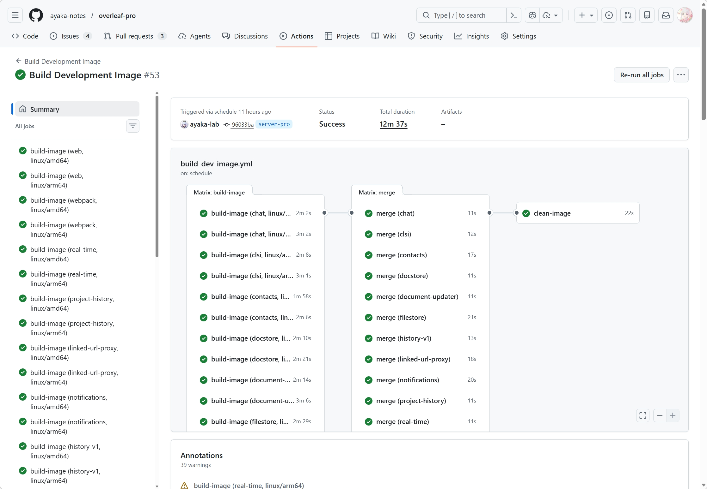
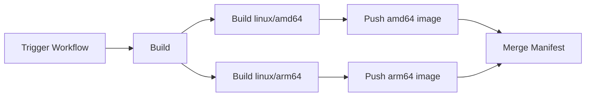

## 使用 GitHub Action 构建多平台的 Docker 镜像



> 前情提要：其实有点感叹，AI 时代大家是不是都不喜欢写博客了，很多人写博客也都是把一个问题丢给 AI 然后让 AI 生成一堆东西，复制粘贴... 经常写文章还是有些好处的，比如写一篇博客的前后，人脑在不断思考怎么行文，组织来龙去脉，不然总感觉很多东西都全部变成没有感情的机器对话了......

### 一、背景

#### 1）为什么需要多架构镜像

在 GitHub 上做开源项目的朋友一定知道，如果做了什么开源软件发布了 Docker 镜像，一定会有一部分群体在 Issue 里面会说一句话：

> 能支持 ARM 吗？我的服务器是 Mac Mini/ARM 机器...

虽然其实我也想不明白为什么总有一些群体喜欢用 ARM 架构的 NAS 或者服务器，但是但凡和 ARM 挂上钩，大部分人都需要从 0 或者源代码开始自己构建软件。

其实早期的 GitHub Runner 是不支持 ARM 镜像的，所以那会有实力的开发者基本都是自己接入自己的 Runner，对于剩余的，大概率就只会说：我们不支持 ARM。三年前的时候我还尝试用 Buildx 构建 ARM 的 Overleaf 镜像，事实证明连运行基本的 `apt` ​命令都是卡到怀疑人生的地步，怎嘛办，很遗憾凉拌，最终放弃。

但是好消息是，从 2024 年开始，GitHub 就[发布博客](https://github.blog/changelog/2024-09-03-github-actions-arm64-linux-and-windows-runners-are-now-generally-available/)开始支持 ARM 镜像的 Runner 了，这意味着所有的公开仓库都可以用 ARM 机器。所以我相信从那时开始已经有不少项目可以正式的发布 ARM 的安装包了。

#### 2）OCI 格式

那有没有办法可以实现用户下载镜像的时候，自动根据服务器的架构选择呢？有一种东西就叫做 OCI Image Spec 体系，他是 Docker 都支持的一种镜像索引结构。具体来说，一个镜像 tag 实际上可以对应**多个架构镜像**：

```text
myimage:latest
 ├─ linux/amd64  -> sha256:aaa
 ├─ linux/arm64  -> sha256:bbb
 └─ linux/arm/v7 -> sha256:ccc
```

当你执行：

```bash
docker pull myimage:latest
```

Docker 会：先下载 **manifest list，** 根据你机器架构选择 amd64/arm64/armv7，然后再拉对应的镜像层。所以用户只需要：

```bash
docker pull image:tag
```

#### 3）聊聊背景

我最近在做 Overleaf 的一些开发，根据社区的一些朋友要求希望能够支持 ARM，不然每次大家都要自己下载代码然后自行构建 ARM 的镜像，说实话很麻烦。所以我调研了一些现有的用 GitHub Action 构建的方案，当然也踩了不少坑，因为 GitHub Action 里面设置 Docker 有很多选项，有些一旦漏了就会出现很多问题：

- 两阶段构建 Docker（第一阶段不推送），二阶段本机无法找到一阶段构建的镜像
- GHCR 的镜像 UI 上面显示 Unknow 的架构
- GHCR 怎么并行构建镜像，提高效率
- GHCR 怎么把不同架构合并为同一个镜像

### 二、工作流实现

#### 1）并行构建

首先我们要理解一下 GitHub 的 Workflow 其实有一些比较高阶的玩法，就是并行构建。首先我们还是回顾一下：

- 一个 Worklflow 就是一个 GitHub 仓库下面固定的 yaml 文件，工作流里面可以包含若干个 Job，工作流触发条件可以是推送、PR 或者手动触发的
- 每个 Job 就是在一台机器上运行的作业，Job 直接可以并行执行，灵活配置
- 每个 Job 里面可以包含若干个 Step，这些任务可以是脚本，也可以是别人写好的内容

‍



那我们其实就是可以利用机器，同时构建 x86 还有 arm 的镜像，这个没有问题。构建完成后，我们把不同架构的镜像推送走，最后我们单独启动一台机器做好 Merge 工作，把两个镜像合并成一个多架构镜像，再推到远端。

可能有人想知道，为什么一定要推送走，其实如果不推走，我们就要把这两个机器构建的镜像全转移到第三台机器上面，然后才能推送这个多架构。

如果我们在中间构建的时候推送走，最后一步 Merge 的任务就会很快的执行，因为远端已经有这个镜像的层了。

这里还有一个很重要的建议：在分别 Push `amd64`​ 和 `arm64` 架构镜像时，建议为每个架构镜像显式添加一个 tag，而不要只作为中间镜像推送（推一个 sha 过去）。因为在 GitHub GHCR 中，通过多架构 manifest 合并生成的镜像默认只会给最终的 manifest 打 tag，而各个架构对应的镜像层通常是无 tag 的。如果之后运行 GHCR 的自动清理任务（cleanup policy），这些没有 tag 的镜像很可能会被当作未引用镜像而被删除。

大概效果如下，其实[官方文档](https://docs.docker.com/build/ci/github-actions/multi-platform/)也有详细的说明怎么构建：

```yaml
name: Build Release Image

# Controls when the workflow will run
on:
  workflow_dispatch:
jobs:
  build:
    strategy:
      fail-fast: false
      matrix:
        include:
        - platform: linux/amd64
          runner: ubuntu-latest
        - platform: linux/arm64
          runner: ubuntu-24.04-arm
    runs-on: ${{ matrix.runner }}
    steps:
      - name: Get latest release branch
        run: |
          # 你的镜像构建脚本

  merge:
    runs-on: ubuntu-latest
    needs:
      - build
    steps:
      - name: Download digests
        run: |
          # 你的镜像合并脚本
  
```

#### 2）两阶段构建镜像要注意的

然后我要说一个我自己在 Overleaf 构建里面踩的坑，就是两阶段或者多阶段构建，例如

- 我先使用 `Dockerfile1`​ 构建一个镜像 `AAAA-base:latest`
- 然后第二个镜像的 `Dockerfile2`​ 使用 `FROM AAAA-base:latest`

这种环境在本地机器看似不会有任何问题，因为 Docker 的本地 image store 会保存已经构建完成的镜像，后续构建时可以直接从本地引用。

但在 GitHub Actions + BuildKit 的环境下情况就不同了。如果没有启用 `containerd-snapshotter`​，BuildKit 默认使用的是 **独立的 build cache**，而不是传统的 Docker image store。这会导致一个非常严重的问题：在同一个 workflow 中前面构建出的镜像，**<u>如果没有推送到远端</u>**，就无法能被后续的 `docker build`​ 直接作为 `FROM` 镜像使用。在二阶段的时候，FROM 会直接去远端的镜像仓库去拉镜像。

所以在设置 Docker 的时候，一定要加上下面的配置内容，否则就多阶段构建找不到。

```yaml
# --- Set up Docker ---
# See: https://docs.docker.com/build/ci/github-actions/multi-platform/
- name: Set up Docker (enable containerd image store)
  uses: docker/setup-docker-action@v4
  with:
    daemon-config: |
      {
        "features": {
          "containerd-snapshotter": true
        }
      }
```

#### 3）如何实现 Merge 镜像

##### a）构建阶段

首先构建阶段，需要把 `digest` 导出然后上传，这里特别提醒一下：provenance 和 sbom 这两个变量必须 false，否则就会导致 UI 上面出现一个神秘不知道架构的镜像。

```yaml
      - name: Build App Image
        id: build_app
        uses: docker/build-push-action@v6
        with:
          context: .
          file: ./server-ce/Dockerfile
          platforms: ${{ matrix.platform }}
          build-args: |
            OVERLEAF_BASE_TAG=${{ env.REGISTRY_IMAGE }}-base:latest-${{ env.PLATFORM_PAIR }}-${{ env.MONOREPO_REVISION }}-${{ github.run_id }}
          labels: |
            ${{ steps.meta.outputs.labels }}
            com.overleaf.pro.revision=${{ env.MONOREPO_REVISION }}
          tags: ${{ env.REGISTRY_IMAGE }}:${{ env.version }}-${{ env.PLATFORM_PAIR }}
          outputs: type=image,name-canonical=true,push=true
          provenance: false
          sbom: false  
      - name: Export digest
        run: |
          mkdir -p ${{ runner.temp }}/digests
          digest="${{ steps.build_app.outputs.digest }}"
          touch "${{ runner.temp }}/digests/${digest#sha256:}"

      - name: Upload digest
        uses: actions/upload-artifact@v4
        with:
          name: digests-${{ env.PLATFORM_PAIR }}
          path: ${{ runner.temp }}/digests/*
          if-no-files-found: error
          retention-days: 1
```

##### b）合并阶段

然后合并阶段的工作流：

- 因为不在一个机器上，所以机器之间需要传递 digest 的值
- 核心就是 `Create manifest list and push` ​这一步会创建一个 manifest，就是一个所谓的多架构合集

```yaml
  merge:
    runs-on: ubuntu-latest
    needs:
      - build
    steps:
      - name: Download digests
        uses: actions/download-artifact@v4
        with:
          path: ${{ runner.temp }}/digests
          pattern: digests-*
          merge-multiple: true

      - name: Login to GHCR Hub
        uses: docker/login-action@v3
        with:
          registry: ${{ env.GHCR_REGISTRY }}
          username: ${{github.actor}}
          password: ${{ secrets.ORGTOKEN }}

      - name: Set up Docker Buildx
        uses: docker/setup-buildx-action@v3

      - name: Docker meta
        id: meta
        uses: docker/metadata-action@v5
        with:
          images: ${{ env.REGISTRY_IMAGE }}
          tags: |
            type=raw,value=latest
            type=raw,value=${{ needs.build.outputs.version }}

      - name: Create manifest list and push
        working-directory: ${{ runner.temp }}/digests
        run: |
          docker buildx imagetools create $(jq -cr '.tags | map("-t " + .) | join(" ")' <<< "$DOCKER_METADATA_OUTPUT_JSON") \
            $(printf '${{ env.REGISTRY_IMAGE }}@sha256:%s ' *)

      - name: Inspect image
        run: |
          docker buildx imagetools inspect ${{ env.REGISTRY_IMAGE }}:${{ needs.build.outputs.version }}

```

### 三、小结

最后小结一下构建多架构镜像的时候，要注意的几个事情

- 需要开并行 `matrix` 构建，这个可以同时启动多个 Runner 运行多个 JOB
- 多个阶段的构建一定要设置好 `containerd-snapshotter`
- 正确的在机器之间传递 digest，并且 merge 的时候需要下载
- 分架构构建的时候，每个架构的镜像一定要打好 tag，而不是推送一个没有 tag 层到远端
- 小技巧：buildx 可以用缓存构建，增加效率，当然 build 的时候可以设置 FROM 和 TO 的缓存

### 四、附录

Demo1 用于样例参考：

```yaml
# ---------------------------------
# This workflow is used to build release images
# and push them to GitHub Container Registry
#
# Published at:
#     ghcr.io/ayaka-notes/overleaf-pro/
#
# ---------------------------------

name: Build Release Image

# Controls when the workflow will run
on:
  workflow_dispatch:

env:
  GHCR_REGISTRY: ghcr.io
  REGISTRY_IMAGE: ghcr.io/${{ github.repository }}

jobs:
  build:
    strategy:
      fail-fast: false
      matrix:
        include:
        - platform: linux/amd64
          runner: ubuntu-latest
        - platform: linux/arm64
          runner: ubuntu-24.04-arm
    runs-on: ${{ matrix.runner }}
    steps:
      - name: Get latest release branch
        run: |
          echo "LATEST_RELEASE_REF=$(git ls-remote --heads --sort='version:refname' https://github.com/ayaka-notes/overleaf-pro.git 'release-v*' | tail -n1 | cut -d/ -f3)" >> $GITHUB_ENV
      - name: "Checkout Repository"
        uses: actions/checkout@main
        with:
          ref: ${{ env.LATEST_RELEASE_REF }}
      - name: Resolve MONOREPO_REVISION
        run: |
          echo "MONOREPO_REVISION=$(git rev-parse HEAD)" >> "$GITHUB_ENV"
      - name: Prepare
        run: |
          platform=${{ matrix.platform }}
          arch=${platform##*/}
          echo "PLATFORM_PAIR=$arch" >> $GITHUB_ENV
      - name: Set release version outputs
        id: set_version
        run: |
          ref="${{ env.LATEST_RELEASE_REF }}"
          # ref is like release-v1.2.3, we want to extract 1.2.3
          version="${ref#release-v}"
          echo "version=$version" >> $GITHUB_ENV
          echo "version=$version" >> $GITHUB_OUTPUT
      - name: Docker meta
        id: meta
        uses: docker/metadata-action@v5
        with:
          images: ${{ env.REGISTRY_IMAGE }}

      - name: Login to GHCR
        uses: docker/login-action@v3
        with:
          registry: ${{ env.GHCR_REGISTRY }}
          username: ${{github.actor}}
          password: ${{ secrets.ORGTOKEN }}
      
      # --- We need to sync package-lock.json/i18 to ensure consistency ---
      - name: "Sync package-lock.json And Prepare .dockerignore"
        run: |
          docker run --rm -v "$(pwd)":/workspace -w /workspace node:22.18.0 npm install --package-lock-only --ignore-scripts
          docker run --rm -v "$(pwd)/services/web/":/overleaf/services/web -w /overleaf/services/web ghcr.io/ayaka-notes/overleaf-pro/dev:webpack npm run extract-translations
          cd ./server-ce/
          cp .dockerignore ../
      
      # --- Set up Docker ---
      # See: https://docs.docker.com/build/ci/github-actions/multi-platform/
      - name: Set up Docker (enable containerd image store)
        uses: docker/setup-docker-action@v4
        with:
          daemon-config: |
            {
              "features": {
                "containerd-snapshotter": true
              }
            }
      - name: Set up Buildx (docker driver)
        uses: docker/setup-buildx-action@v3
        with:
          driver: docker

      - name: Build Base Image
        id: build_base
        uses: docker/build-push-action@v6
        with:
          context: .
          file: ./server-ce/Dockerfile-base
          platforms: ${{ matrix.platform }}
          labels: ${{ steps.meta.outputs.labels }}
          tags: ${{ env.REGISTRY_IMAGE }}-base:latest-${{ env.PLATFORM_PAIR }}-${{ env.MONOREPO_REVISION }}-${{ github.run_id }}
          push: false
          load: true
          provenance: false
          sbom: false
      - name: Build App Image
        id: build_app
        uses: docker/build-push-action@v6
        with:
          context: .
          file: ./server-ce/Dockerfile
          platforms: ${{ matrix.platform }}
          build-args: |
            OVERLEAF_BASE_TAG=${{ env.REGISTRY_IMAGE }}-base:latest-${{ env.PLATFORM_PAIR }}-${{ env.MONOREPO_REVISION }}-${{ github.run_id }}
          labels: |
            ${{ steps.meta.outputs.labels }}
            com.overleaf.pro.revision=${{ env.MONOREPO_REVISION }}
          tags: ${{ env.REGISTRY_IMAGE }}:${{ env.version }}-${{ env.PLATFORM_PAIR }}
          outputs: type=image,name-canonical=true,push=true
          provenance: false
          sbom: false
      
      - name: Export digest
        run: |
          mkdir -p ${{ runner.temp }}/digests
          digest="${{ steps.build_app.outputs.digest }}"
          touch "${{ runner.temp }}/digests/${digest#sha256:}"

      - name: Upload digest
        uses: actions/upload-artifact@v4
        with:
          name: digests-${{ env.PLATFORM_PAIR }}
          path: ${{ runner.temp }}/digests/*
          if-no-files-found: error
          retention-days: 1
    outputs:
      version: ${{ steps.set_version.outputs.version }}
  merge:
    runs-on: ubuntu-latest
    needs:
      - build
    steps:
      - name: Download digests
        uses: actions/download-artifact@v4
        with:
          path: ${{ runner.temp }}/digests
          pattern: digests-*
          merge-multiple: true

      - name: Login to GHCR Hub
        uses: docker/login-action@v3
        with:
          registry: ${{ env.GHCR_REGISTRY }}
          username: ${{github.actor}}
          password: ${{ secrets.ORGTOKEN }}

      - name: Set up Docker Buildx
        uses: docker/setup-buildx-action@v3

      - name: Docker meta
        id: meta
        uses: docker/metadata-action@v5
        with:
          images: ${{ env.REGISTRY_IMAGE }}
          tags: |
            type=raw,value=latest
            type=raw,value=${{ needs.build.outputs.version }}

      - name: Create manifest list and push
        working-directory: ${{ runner.temp }}/digests
        run: |
          docker buildx imagetools create $(jq -cr '.tags | map("-t " + .) | join(" ")' <<< "$DOCKER_METADATA_OUTPUT_JSON") \
            $(printf '${{ env.REGISTRY_IMAGE }}@sha256:%s ' *)

      - name: Inspect image
        run: |
          docker buildx imagetools inspect ${{ env.REGISTRY_IMAGE }}:${{ needs.build.outputs.version }}

      # --- Retention Policy: Delete old images ---
      - name: Delete old images
        uses: snok/container-retention-policy@v2
        with:
          image-names: overleaf-pro
          cut-off: 1s, UTC+8
          account-type: org
          org-name: ayaka-notes
          untagged-only: true
          token: ${{ secrets.ORGTOKEN }}
```

Demo2 用于样例参考（这个例子增加了二维矩阵级别的构建，效率更高）：

```yaml
# ---------------------------------
# This workflow is used to build development images
# and push them to GitHub Container Registry
#
# Published at:
#     ghcr.io/ayaka-notes/overleaf-pro/dev
#
# ---------------------------------

name: Build Development Image
on:
  workflow_dispatch:
  schedule:
    - cron: '0 0 * * *'

env:
  GHCR_REGISTRY: ghcr.io

jobs:
  build-image:
    strategy:
      fail-fast: false
      max-parallel: 8
      matrix:
        image-name:
          [
            web,
            webpack,
            real-time,
            project-history,
            linked-url-proxy,
            notifications,
            history-v1,
            filestore,
            document-updater,
            docstore,
            contacts,
            chat,
            clsi
          ]
        platform: [linux/amd64, linux/arm64]
        include:
          - platform: linux/amd64
            runner: ubuntu-latest
            platform_pair: amd64
          - platform: linux/arm64
            runner: ubuntu-24.04-arm
            platform_pair: arm64
    runs-on: ${{ matrix.runner }}
    steps:
      - name: "Checkout Current Repository"
        uses: actions/checkout@main
        with:
          ref: server-pro
      - name: "Setup node environment"
        uses: actions/setup-node@v3
        with:
          node-version: "22.x"
      - name: "Sync package-lock.json"
        run: |
          npm install --package-lock-only --ignore-scripts
      - name: "Login to GitHub Container Registry"
        uses: docker/login-action@v3.0.0
        with:
          registry: ${{env.GHCR_REGISTRY}}
          username: ${{github.actor}}
          password: ${{secrets.GITHUB_TOKEN}}
      - name: Disable buildx default attestations
        run: |
          echo "BUILDX_NO_DEFAULT_ATTESTATIONS=1" >> $GITHUB_ENV
      - name: "Clone Overleaf And Build"
        env:
          PLATFORM_PAIR: ${{ matrix.platform_pair }}
        run: |
          export BUILDX_NO_DEFAULT_ATTESTATIONS=1
          cd ./develop/
          bin/build ${{matrix.image-name}}
          docker tag develop-${{matrix.image-name}}:latest ${{env.GHCR_REGISTRY}}/ayaka-notes/overleaf-pro/dev:${{matrix.image-name}}-${PLATFORM_PAIR}
          docker push ${{env.GHCR_REGISTRY}}/ayaka-notes/overleaf-pro/dev:${{matrix.image-name}}-${PLATFORM_PAIR}
  
  merge:
    runs-on: ubuntu-latest
    needs: build-image
    strategy:
      fail-fast: false
      matrix:
        image-name: [
          web,
          webpack,
          real-time,
          project-history,
          linked-url-proxy,
          notifications,
          history-v1,
          filestore,
          document-updater,
          docstore,
          contacts,
          chat,
          clsi
        ]

    steps:
      - name: Login to GHCR (org token recommended for manifest)
        uses: docker/login-action@v3
        with:
          registry: ${{ env.GHCR_REGISTRY }}
          username: ${{ github.actor }}
          password: ${{ secrets.ORGTOKEN }}

      - name: Set up Docker Buildx
        uses: docker/setup-buildx-action@v3

      - name: Create and push manifest list (multi-arch tag)
        run: |
          docker buildx imagetools create \
            -t ghcr.io/ayaka-notes/overleaf-pro/dev:${{ matrix.image-name }} \
            ghcr.io/ayaka-notes/overleaf-pro/dev:${{ matrix.image-name }}-amd64 \
            ghcr.io/ayaka-notes/overleaf-pro/dev:${{ matrix.image-name }}-arm64

      - name: Inspect manifest
        run: |
          docker buildx imagetools inspect ghcr.io/ayaka-notes/overleaf-pro/dev:${{ matrix.image-name }}

  clean-image:
    runs-on: ubuntu-latest
    needs: merge
    steps:
      - name: Delete old images
        uses: snok/container-retention-policy@v2
        with:
          image-names: overleaf-pro/dev*
          cut-off: 7 days ago UTC
          account-type: org
          org-name: ayaka-notes
          untagged-only: true
          token: ${{ secrets.ORGTOKEN }}

```
